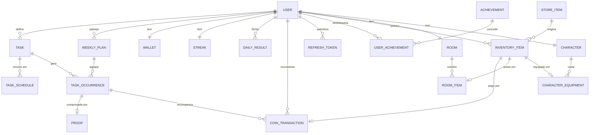

# TaskGame

App de produtividade gamificada e mobile-first: tarefas da vida real, como estudar, ler, treinar e dormir no horário, viram pontos, moedas e uma sequência de dias cumpridos, no estilo do Duolingo e do Habitica. Roda como PWA instalável no celular.

**Status:** Fase 3 de 5 concluída. Além do loop principal (missões, plano da semana, tela Hoje, conclusão com foto, moedas, sequência e virada do dia), já dá para gastar moedas na loja, montar a coleção, colocar itens no quarto, vestir o personagem e desbloquear conquistas. Ranking, estatísticas e resumo semanal chegam na Fase 4. Veja as [fases](#fases).

## Stack

| Camada | Tecnologias |
|---|---|
| Backend | Java 25, Spring Boot 4.1 (Web MVC, Data JPA, Security com OAuth2 Resource Server, Validation, Actuator), Flyway, PostgreSQL 17, springdoc-openapi, Maven |
| Frontend | React 19, TypeScript, Vite 8, React Router 8, TanStack Query 5, CSS Modules, vite-plugin-pwa (Workbox) |
| Testes | JUnit, AssertJ, Mockito, MockMvc e Testcontainers com PostgreSQL real |
| Infra | Docker Compose e Nginx |

## Rodar com Docker

Pré-requisito: Docker com Compose.

```bash
cp .env.example .env
# edite o .env e preencha JWT_SECRET (por exemplo, com: openssl rand -base64 48)
docker compose up --build
```

| Endereço | O que é |
|---|---|
| http://localhost:3000 | O app (PWA) |
| http://localhost:8080/swagger-ui.html | Documentação interativa da API |
| http://localhost:8080/actuator/health | Health check |

O primeiro build baixa as dependências do Maven e do npm e leva alguns minutos.

As fotos de prova ficam no volume `proofs`, montado em `/app/data` no backend, e sobrevivem a rebuilds. Fora do Docker, ficam na pasta `data/` do diretório onde o backend roda (ignorada pelo Git).

## Desenvolvimento

Pré-requisitos: JDK 25, Node 22 (ou 20.19+) e Docker, usado pelo banco e pelos testes de integração.

```bash
docker compose up -d db        # só o PostgreSQL

cd backend
./mvnw spring-boot:run         # API em http://localhost:8080 (no Windows: mvnw.cmd spring-boot:run)

cd frontend
npm install
npm run dev                    # app em http://localhost:5173, com proxy de /api para a porta 8080
```

O backend lê o `.env` da raiz, o mesmo do Compose, e as migrations do Flyway rodam sozinhas ao subir.

### Testes

```bash
cd backend
./mvnw test       # unitários: tokens, dia congelado, recompensas, streak, conquistas, estado do personagem e outras regras puras
./mvnw verify     # unitários + integração (sobe um PostgreSQL com Testcontainers; precisa do Docker)

cd frontend
npm run lint
npm run build     # checa os tipos com tsc e gera o build de produção
```

## Usar no celular

Instalar um PWA exige HTTPS, exceto em `localhost`. O jeito mais simples é um túnel temporário:

1. Suba a stack com `docker compose up --build`.
2. Rode `cloudflared tunnel --url http://localhost:3000` ([como instalar o cloudflared](https://developers.cloudflare.com/cloudflare-one/connections/connect-networks/downloads/)). Ele mostra um endereço `https://…trycloudflare.com`.
3. Abra esse endereço no Chrome do Android e escolha **Instalar app** no menu. No iPhone, use **Adicionar à Tela de Início** no menu de compartilhar do Safari.

Com o app atrás de HTTPS, dá para usar `AUTH_COOKIE_SECURE=true` no `.env`.

## Arquitetura

```
PWA (React) ──HTTPS──▶ Nginx ──/api──▶ Spring Boot (monólito modular) ──▶ PostgreSQL
```

- **Backend:** monólito modular, com um pacote por funcionalidade (`auth`, `user`, `task`, `planning`, `completion`, `economy`, `streak`, `today`, `store`, `room`, `character`, `achievement` e, na próxima fase, ranking, estatísticas e game-state) e as camadas controller, service, repository, domain, dto e mapper dentro de cada um. Regras ficam em entidades com comportamento e em políticas puras, testáveis sem Spring.
- **Frontend:** telas organizadas por funcionalidade; hooks de dados (TanStack Query) separados dos componentes de apresentação, para a futura camada visual do jogo entrar por composição.
- **Mesma origem:** o Nginx serve o app e encaminha `/api` ao backend (em desenvolvimento, o proxy do Vite faz isso). Sem CORS.
- **Erros:** toda resposta de erro sai em Problem Details (RFC 9457) com um `code` estável, que o frontend traduz em mensagem.

O desenho completo, com requisitos, regras de negócio, endpoints e decisões técnicas justificadas, está em [docs/architecture.md](docs/architecture.md).

### Modelo de dados

Visão completa do MVP. As tabelas já criadas, com todas as colunas, estão em [docs/domain-model.md](docs/domain-model.md).



## Sessão e segurança

- **Access token:** JWT HS256 de 15 minutos, validado pelo Resource Server do Spring Security. No app, fica só em memória.
- **Refresh token:** opaco, de 30 dias, num cookie `HttpOnly`, `SameSite=Strict` e restrito a `/api/v1/auth`. O banco guarda só o hash SHA-256. Cada renovação troca o token, e reapresentar um token já trocado revoga a sessão inteira, com uma tolerância de 10 segundos para abas que renovam juntas.
- **Senha:** BCrypt, com o limite de 72 bytes validado. O login leva o mesmo tempo para e-mail inexistente e senha errada, para não revelar quais e-mails têm conta.
- **Renovação no app:** um 401 dispara uma única renovação por vez, mesmo com várias abas abertas (Web Locks), e a requisição é repetida uma vez.

## API

Rotas sob `/api/v1`. As de `/auth` são públicas; as demais exigem `Authorization: Bearer <token>`.

| Método | Rota | O que faz |
|---|---|---|
| POST | `/auth/register` | Cria a conta e abre a sessão (201) |
| POST | `/auth/login` | Entra com e-mail e senha |
| POST | `/auth/refresh` | Troca o cookie de refresh por um novo par de tokens |
| POST | `/auth/logout` | Encerra a sessão deste dispositivo (204) |
| GET | `/me` | Perfil do usuário autenticado |
| PATCH | `/me` | Atualiza nome, fuso horário ou visibilidade no ranking |

Exemplo de erro:

```json
{
  "type": "about:blank",
  "title": "Bad Request",
  "status": 400,
  "detail": "Há campos inválidos na requisição.",
  "instance": "/api/v1/auth/register",
  "code": "VALIDATION_FAILED",
  "errors": [
    { "field": "password", "message": "a senha precisa de pelo menos 8 caracteres" }
  ]
}
```

Há requisições prontas para o IntelliJ ou o VS Code em [docs/api-examples.http](docs/api-examples.http). As rotas das próximas fases estão na seção 7 de [docs/architecture.md](docs/architecture.md).

## Estrutura do repositório

```
gasmtask/
├── backend/                    # API Spring Boot
│   └── src/main/java/com/gasmtask/
│       ├── auth/               # cadastro, login, refresh rotativo, logout
│       ├── user/               # perfil
│       └── shared/             # segurança (JWT), erros, validação, configuração
├── frontend/                   # PWA React
│   └── src/
│       ├── api/                # cliente HTTP, tipos e erros
│       ├── auth/               # estado da sessão
│       ├── app/                # rotas, guardas, telas de sessão e de erro
│       ├── features/           # telas por funcionalidade
│       ├── components/         # componentes compartilhados
│       └── sw.ts               # service worker
├── docs/                       # arquitetura, modelo de dados e exemplos de requisição
└── docker-compose.yml
```

## Fases

1. **Fundação (concluída).** Monorepo, Docker Compose, migrations, autenticação completa, perfil, tratamento de erros, Swagger, PWA, telas de entrar e cadastro, navegação inferior, tela Hoje inicial e perfil.
2. **Loop principal (concluída).** Missões com recorrência e sugestão de dias, plano da semana atual e da próxima, dia congelado (hoje aceita inclusões, não remoções), tela Hoje, conclusão com ou sem foto, recompensas calculadas no backend, carteira com extrato, sequência e fechamento automático do dia. Visual com marca-textos neon por categoria e o cabeçalho que muda de cor com o período do dia.
3. **Coleção (concluída).** Loja com 18 itens (de 5 a 200 moedas), compra atômica com extrato, coleção, quarto e personagem com slots (como listas, sem ilustração por enquanto), estado do personagem derivado da tarefa em andamento e 15 conquistas avaliadas a cada conclusão e na virada do dia.
4. **Visão.** Ranking, estatísticas, resumo semanal, estrutura de lembretes e game-state.
5. **Entrega.** Testes restantes, usuário de demonstração e revisão final.
