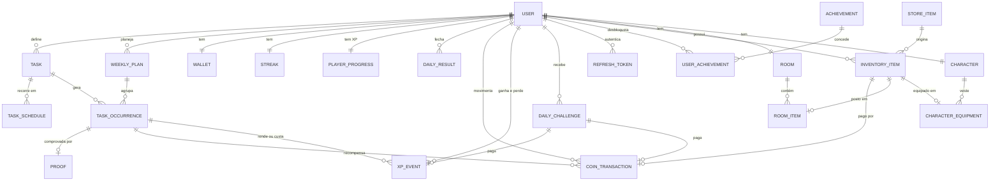

# TaskGame

App de produtividade gamificada e mobile-first: tarefas da vida real, como estudar, ler, treinar e dormir no horário, viram XP, moedas, elo ranqueado e uma sequência de dias cumpridos, no estilo do Duolingo, do Habitica e das ranqueadas dos jogos. Roda como PWA instalável no celular.

**Status:** MVP concluído (5 de 5 fases), mais um modo jogo: elo ranqueado com roupas por elo, atributos de RPG, desafios diários e protetor de sequência. Veja as [fases](#fases) e [como usar no celular](#usar-no-celular).

## O que dá para fazer

- **Planejar:** missões com recorrência (dias e horário, ou "N vezes por semana" com sugestão de dias), plano da semana atual e da próxima, extras para os próximos dias. Hoje aceita inclusões, não remoções.
- **Cumprir:** tela Hoje com a próxima tarefa e o período do dia, conclusão com foto, bônus por fazer no horário, sequência de dias cumpridos e virada automática do dia.
- **Subir de elo:** cada tarefa rende XP e cada obrigatória perdida tira. O XP define o elo, de Ferro 1 a Lenda, e cada elo libera uma roupa exclusiva.
- **Treinar atributos:** Estudo treina Inteligência, Exercício treina Força, Leitura treina Sabedoria, e assim por diante, cada atributo com nível próprio na ficha do personagem.
- **Desafios do dia:** três metas sorteadas por dia (Madrugador, Pontual, Maratona…) valendo XP e moedas.
- **Gastar moedas:** loja com móveis, decoração e roupas, quarto, personagem e o protetor de sequência, que salva um dia de falha.
- **Acompanhar:** conquistas, estatísticas (planejado × concluído por semana ou mês), resumo semanal, ranking por elo ou da semana e lembretes.

## Stack

| Camada | Tecnologias |
|---|---|
| Backend | Java 25, Spring Boot 4.1 (Web MVC, Data JPA, Security com OAuth2 Resource Server, Validation, Actuator), Flyway, PostgreSQL 17, springdoc-openapi, Maven |
| Frontend | React 19, TypeScript, Vite 8, React Router 8, TanStack Query 5, CSS Modules, vite-plugin-pwa (Workbox) |
| Testes | JUnit, AssertJ, Mockito, MockMvc e PostgreSQL real embutido (sem Docker); Vitest no frontend |
| Infra | Docker Compose e Nginx para rodar local; imagem única (Dockerfile da raiz) para publicar |

## Rodar com Docker

Pré-requisito: Docker com Compose.

```bash
cp .env.example .env
# edite o .env e preencha JWT_SECRET (por exemplo, com: openssl rand -base64 48)
docker compose up --build
```

| Endereço | O que é |
|---|---|
| http://localhost:3000 | O app (PWA) |
| http://localhost:8080/swagger-ui.html | Documentação interativa da API |
| http://localhost:8080/actuator/health | Health check |

O primeiro build baixa as dependências do Maven e do npm e leva alguns minutos.

As fotos de prova ficam no volume `proofs`, montado em `/app/data` no backend, e sobrevivem a rebuilds. Fora do Docker, ficam na pasta `data/` do diretório onde o backend roda (ignorada pelo Git).

## Desenvolvimento

Pré-requisitos: JDK 25, Node 22 (ou 20.19+) e um PostgreSQL 17 ou mais novo. O Docker é opcional.

O banco pode vir de dois lugares:

- **PostgreSQL instalado na máquina** (sem Docker). Crie o usuário e o banco uma vez, com o `psql` do usuário `postgres`:

  ```sql
  CREATE USER gasmtask WITH PASSWORD 'gasmtask';
  CREATE DATABASE gasmtask OWNER gasmtask;
  ```

  Se o servidor não estiver em `localhost:5432`, defina `DB_URL` no `.env` (por exemplo, `DB_URL=jdbc:postgresql://localhost:5433/gasmtask`).
- **Docker:** `docker compose up -d db` sobe só o PostgreSQL.

Com o banco no ar:

```bash
cp .env.example .env           # e preencha JWT_SECRET (no Windows: copy .env.example .env)

cd backend
./mvnw spring-boot:run         # API em http://localhost:8080 (no Windows: mvnw.cmd spring-boot:run)

cd frontend
npm install
npm run dev                    # app em http://localhost:5173, com proxy de /api para a porta 8080
```

O backend lê o `.env` da raiz, o mesmo do Compose, e as migrations do Flyway rodam sozinhas ao subir.

Se a porta 8080 estiver ocupada (por um Apache, por exemplo), defina `SERVER_PORT` no `.env`. O backend sobe nessa porta e o proxy do Vite aponta para ela.

### Conta de demonstração

Com o perfil `dev`, o backend cria na primeira subida a conta **demo@gasmtask.app** (senha **demo1234**). Ela vem com seis semanas de histórico, elo acima do Ferro com as roupas ganhas, conquistas, sequência, quarto montado, personagem vestido e um protetor guardado. Também cria quatro rivais para o ranking ter gente.

```bash
cd backend
./mvnw spring-boot:run -Dspring-boot.run.profiles=dev     # no Windows: mvnw.cmd spring-boot:run "-Dspring-boot.run.profiles=dev"
```

Não use o perfil `dev` num servidor aberto: a senha da demo é pública.

### Testes

```bash
cd backend
./mvnw test       # unitários: tokens, dia congelado, recompensas, streak, elo, atributos, desafios, lembretes e outras regras puras
./mvnw verify     # unitários + integração (sobe um PostgreSQL embutido; não precisa de Docker nem de banco instalado)

cd frontend
npm test          # datas e fuso, elo, escala do gráfico e texto dos lembretes (Vitest)
npm run lint
npm run build     # checa os tipos com tsc e gera o build de produção
```

## Publicar na internet

O [Dockerfile](Dockerfile) da raiz gera **uma imagem só**: compila o PWA e o coloca dentro do Spring Boot, que serve o app e a API no mesmo endereço. Ela roda em qualquer serviço de contêiner e é montada no próprio serviço, então não precisa de Docker na sua máquina.

**Recomendado: [Railway](https://railway.com).** Custa US$ 5 por mês, com US$ 5 de uso incluídos (dá para testar 30 dias com crédito grátis). O app não dorme, tem PostgreSQL e volume para as fotos.

1. Crie um projeto, escolha **Deploy from GitHub repo** e aponte para este repositório (ele acha o `Dockerfile` da raiz sozinho).
2. No mesmo projeto, adicione um **PostgreSQL** (botão **+ New → Database → PostgreSQL**).
3. No serviço do app, em **Variables**, defina:

   | Variável | Valor |
   |---|---|
   | `DB_URL` | `jdbc:postgresql://${{Postgres.PGHOST}}:${{Postgres.PGPORT}}/${{Postgres.PGDATABASE}}` |
   | `DB_USER` | `${{Postgres.PGUSER}}` |
   | `DB_PASSWORD` | `${{Postgres.PGPASSWORD}}` |
   | `JWT_SECRET` | um valor novo e aleatório (`openssl rand -base64 48`), diferente do de desenvolvimento |
   | `AUTH_COOKIE_SECURE` | `true` |

4. Em **Settings → Networking**, gere um domínio (`…up.railway.app`). O HTTPS vem pronto.
5. Para as fotos de prova sobreviverem a novas versões, adicione um **Volume** montado em `/app/data`.

A cada `git push` na `main`, o Railway publica a versão nova. As migrations rodam sozinhas ao subir.

**Alternativas:**

- **[Render](https://render.com):** o plano grátis serve para experimentar, mas o app dorme depois de 15 minutos sem acesso e leva cerca de 1 minuto para acordar, e o PostgreSQL grátis expira em 30 dias. Use o mesmo Dockerfile e as mesmas variáveis.
- **Uma VM própria** (Oracle Cloud Always Free, por exemplo): grátis e sem limite de sono, mas você cuida do servidor. Use o `docker-compose.yml` com um proxy HTTPS (Caddy, por exemplo) na frente.

## Usar no celular

**Com o app publicado:** abra o endereço no celular. No Android (Chrome), escolha **Instalar app** no menu. No iPhone (Safari), use **Compartilhar → Adicionar à Tela de Início**. O app abre em tela cheia, com ícone, como um app instalado.

**Sem publicar, a partir do seu computador** (o computador precisa ficar ligado). Instalar um PWA exige HTTPS, e um túnel temporário resolve:

1. Suba o backend (`mvnw.cmd spring-boot:run` na pasta `backend`).
2. Na pasta `frontend`, gere e sirva a versão de produção: `npm run build` e depois `npm run preview` (porta 4173, com o mesmo proxy de `/api`).
3. Rode `cloudflared tunnel --url http://localhost:4173` ([como instalar o cloudflared](https://developers.cloudflare.com/cloudflare-one/connections/connect-networks/downloads/)). Ele mostra um endereço `https://…trycloudflare.com`, que muda a cada vez.
4. Abra esse endereço no celular e instale como acima.

Com Docker, o túnel aponta para `http://localhost:3000` (`docker compose up --build`).

### Virar app de loja (opcional)

O PWA instalado já se comporta como app. Para estar na Play Store ou na App Store, ele precisa ser empacotado:

- **Android (Play Store):** o [PWABuilder](https://www.pwabuilder.com) gera o pacote (Trusted Web Activity) a partir do endereço publicado. Precisa de uma conta de desenvolvedor do Google Play (taxa única de US$ 25) e de publicar o arquivo `/.well-known/assetlinks.json` que o PWABuilder gera. Coloque-o em `frontend/public/.well-known/assetlinks.json`; a imagem única já o serve.
- **iPhone (App Store):** o PWABuilder também gera um projeto iOS, mas publicar exige uma conta Apple Developer (US$ 99 por ano) e um Mac com Xcode. Sem isso, o caminho é **Adicionar à Tela de Início**.

## Arquitetura

```
Local (Compose):   PWA (React) ──▶ Nginx ──/api──▶ Spring Boot ──▶ PostgreSQL
Publicado (imagem única):  PWA + API no mesmo Spring Boot ──▶ PostgreSQL
```

- **Backend:** monólito modular, com um pacote por funcionalidade (`auth`, `user`, `task`, `planning`, `completion`, `economy`, `streak`, `today`, `store`, `room`, `character`, `achievement`, `stats`, `ranking`, `progression`, `challenge`, `notification`, `gamestate` e `demo`) e as camadas controller, service, repository, domain, dto e mapper dentro de cada um. Regras ficam em entidades com comportamento e em políticas puras, testáveis sem Spring.
- **Frontend:** telas organizadas por funcionalidade; hooks de dados (TanStack Query) separados dos componentes de apresentação, para a futura camada visual do jogo entrar por composição.
- **Mesma origem:** o app e a API respondem no mesmo endereço (Nginx no Compose, o próprio Spring Boot na imagem única, o proxy do Vite em desenvolvimento). Sem CORS.
- **Erros:** toda resposta de erro sai em Problem Details (RFC 9457) com um `code` estável, que o frontend traduz em mensagem.

O desenho completo, com requisitos, regras de negócio, endpoints e decisões técnicas justificadas, está em [docs/architecture.md](docs/architecture.md).

### Modelo de dados

As tabelas, com todas as colunas, estão em [docs/domain-model.md](docs/domain-model.md).



## Sessão e segurança

- **Access token:** JWT HS256 de 15 minutos, validado pelo Resource Server do Spring Security. No app, fica só em memória.
- **Refresh token:** opaco, de 30 dias, num cookie `HttpOnly`, `SameSite=Strict` e restrito a `/api/v1/auth`. O banco guarda só o hash SHA-256. Cada renovação troca o token, e reapresentar um token já trocado revoga a sessão inteira, com uma tolerância de 10 segundos para abas que renovam juntas.
- **Senha:** BCrypt, com o limite de 72 bytes validado. O login leva o mesmo tempo para e-mail inexistente e senha errada, para não revelar quais e-mails têm conta.
- **Renovação no app:** um 401 dispara uma única renovação por vez, mesmo com várias abas abertas (Web Locks), e a requisição é repetida uma vez.
- **Privacidade:** o ranking mostra só o nome de exibição e o valor, e quem quiser pode não aparecer. Fotos de prova só são vistas pelo dono.

## API

Rotas sob `/api/v1`. As de `/auth` são públicas; as demais exigem `Authorization: Bearer <token>`. Algumas das principais:

| Método | Rota | O que faz |
|---|---|---|
| POST | `/auth/register` · `/auth/login` | Cria a conta ou entra, e abre a sessão |
| GET | `/today` | Tela Hoje numa chamada: tarefas, progresso, sequência, elo e desafios do dia |
| POST | `/occurrences/{id}/complete` | Conclui (foto opcional) e devolve moedas, XP, atributo treinado e desafios cumpridos |
| GET | `/weeks/current` · `/weeks/next` | Plano da semana |
| GET | `/me/rank` | Elo, escada, roupas de elo e extrato de XP |
| GET | `/rankings?metric=XP` | Ranking por elo (ou da semana: `POINTS`, `COMPLETED_TASKS`, `COINS_EARNED`, `STREAK`) |
| GET | `/character` | Personagem: estado, roupas e a ficha de atributos |
| POST | `/streak/freezes` | Compra um protetor de sequência |
| GET | `/stats/overview` · `/weeks/{weekStart}/summary` | Estatísticas e resumo semanal |

Exemplo de erro:

```json
{
  "type": "about:blank",
  "title": "Bad Request",
  "status": 400,
  "detail": "Há campos inválidos na requisição.",
  "instance": "/api/v1/auth/register",
  "code": "VALIDATION_FAILED",
  "errors": [
    { "field": "password", "message": "a senha precisa de pelo menos 8 caracteres" }
  ]
}
```

Há requisições prontas para o IntelliJ ou o VS Code em [docs/api-examples.http](docs/api-examples.http). A lista completa de rotas está na seção 7 de [docs/architecture.md](docs/architecture.md) e no Swagger.

## Estrutura do repositório

```
gasmtask/
├── backend/                    # API Spring Boot
│   └── src/main/java/com/gasmtask/
│       ├── auth/               # cadastro, login, refresh rotativo, logout
│       ├── user/               # perfil e preferências de lembrete
│       ├── task/ planning/     # missões, plano semanal e dia congelado
│       ├── completion/ economy/ streak/ today/   # conclusão, moedas, sequência, protetor e tela Hoje
│       ├── store/ room/ character/ achievement/  # coleção, personagem com atributos e conquistas
│       ├── progression/        # XP e elo ranqueado
│       ├── challenge/          # desafios diários
│       ├── stats/ ranking/     # estatísticas, resumo semanal e ranking
│       ├── notification/       # cálculo dos lembretes
│       ├── gamestate/          # estado consolidado para a camada visual
│       ├── demo/               # conta de demonstração (perfil dev)
│       └── shared/             # segurança (JWT), erros, validação, configuração, servidor do PWA
├── frontend/                   # PWA React
│   └── src/
│       ├── api/                # cliente HTTP, tipos e erros
│       ├── auth/               # estado da sessão
│       ├── app/                # rotas, guardas, telas de sessão e de erro
│       ├── features/           # telas por funcionalidade
│       ├── components/         # componentes compartilhados (inclusive o emblema de elo)
│       ├── game/               # canal de avisos de recompensa e memória do elo
│       └── sw.ts               # service worker
├── docs/                       # arquitetura, modelo de dados e exemplos de requisição
├── Dockerfile                  # imagem única para publicar
└── docker-compose.yml          # Nginx + API + PostgreSQL para rodar local
```

## Fases

1. **Fundação (concluída).** Monorepo, Docker Compose, migrations, autenticação completa, perfil, tratamento de erros, Swagger, PWA, telas de entrar e cadastro, navegação inferior, tela Hoje inicial e perfil.
2. **Loop principal (concluída).** Missões com recorrência e sugestão de dias, plano da semana atual e da próxima, dia congelado (hoje aceita inclusões, não remoções), tela Hoje, conclusão com ou sem foto, recompensas calculadas no backend, carteira com extrato, sequência e fechamento automático do dia. Visual com marca-textos neon por categoria e o cabeçalho que muda de cor com o período do dia.
3. **Coleção (concluída).** Loja com 18 itens (de 5 a 200 moedas), compra atômica com extrato, coleção, quarto e personagem com slots (como listas, sem ilustração por enquanto), estado do personagem derivado da tarefa em andamento e 15 conquistas avaliadas a cada conclusão e na virada do dia.
4. **Visão (concluída).** Estatísticas desde o cadastro e planejado × concluído por semana ou mês, resumo semanal (parcial ou final) com atalho para planejar a próxima, ranking com a posição de quem consulta (respeitando quem prefere não aparecer), lembretes de tarefas, de dormir e de acordar enquanto o app está aberto, e `GET /me/game-state` para a futura camada visual.
5. **Entrega (concluída).** Testes restantes (isolamento das provas, job do fechamento do dia e testes do frontend com Vitest), conta de demonstração no perfil `dev`, imagem única para publicar e revisão final da documentação.

**Modo jogo (depois do MVP).** Elo ranqueado (XP que sobe com as tarefas e desce com as obrigatórias perdidas, de Ferro 1 a Lenda, com uma roupa exclusiva por elo), atributos de RPG treinados por categoria, três desafios diários valendo XP e moedas, e o protetor de sequência.

**Próximas ideias:** camada visual do quarto e do personagem (o `game-state` já entrega tudo), Web Push para lembretes com o app fechado, temporadas de elo, chefe da semana e ranking entre amigos.
