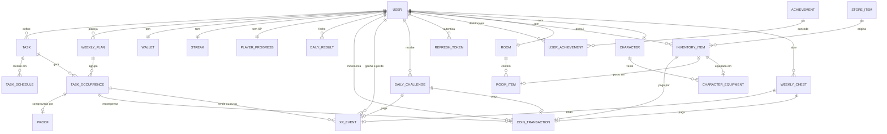

# TaskGame

App de produtividade gamificada e mobile-first: tarefas da vida real, como estudar, ler, treinar e dormir no horário, viram XP, moedas, elo ranqueado e uma sequência de dias cumpridos, no estilo do Duolingo, do Habitica e das ranqueadas dos jogos. Roda como PWA instalável no celular.

**Status:** MVP concluído (5 de 5 fases), mais o modo jogo (elo ranqueado, atributos, desafios diários e protetor de sequência) e a fase de evolução e identidade: evolução por missão, títulos, baú semanal, visual em pixel art e a base para virar SaaS. Veja as [fases](#fases), [como publicar](#publicar-na-internet) e [como usar no celular](#usar-no-celular).

## O que dá para fazer

- **Planejar:** missões com recorrência (dias e horário, ou "N vezes por semana" com sugestão de dias), plano da semana atual e da próxima, extras para os próximos dias. Hoje aceita inclusões, não remoções.
- **Cumprir:** tela Hoje com a próxima tarefa e o período do dia, conclusão com foto, bônus por fazer no horário, sequência de dias cumpridos e virada automática do dia.
- **Subir de elo:** cada tarefa rende XP e cada obrigatória perdida tira. O XP define o elo, de Ferro 1 a Lenda, e cada elo libera uma roupa exclusiva.
- **Treinar atributos:** Estudo treina Inteligência, Exercício treina Força, Leitura treina Sabedoria, e assim por diante, cada atributo com nível próprio na ficha do personagem.
- **Desafios do dia:** três metas sorteadas por dia (Madrugador, Pontual, Maratona…) valendo XP e moedas.
- **Gastar moedas:** loja com móveis, decoração e roupas, quarto, personagem e o protetor de sequência, que salva um dia de falha.
- **Acompanhar:** conquistas, estatísticas (planejado × concluído por semana ou mês), resumo semanal, ranking por elo ou da semana e lembretes.
- **Ver a evolução de cada missão:** quantas vezes você foi à academia ou estudou em cada semana, a taxa, a sequência e o recorde, a média semanal e o melhor mês.
- **Ganhar títulos:** treinar um atributo até os níveis 3, 6 e 10 dá títulos como "Rato de academia" e "Mestre nos estudos", mostrados no topo do dia, no perfil e no ranking.
- **Abrir o baú da semana:** quanto mais dias cumpridos, melhor o baú de segunda (madeira, prata, ouro ou lendário), com moedas, XP e, nos maiores, um item.
- **Jogar com os olhos:** o personagem, as roupas, o quarto, os baús e a cena do dia (céu que muda com a hora) são desenhados em pixel art, com comemoração em tela cheia para título novo, subida de elo e baú.
- **Cuidar da conta:** baixar todos os dados em JSON e excluir a conta, confirmando com a senha.

## Stack

| Camada | Tecnologias |
|---|---|
| Backend | Java 25, Spring Boot 4.1 (Web MVC, Data JPA, Security com OAuth2 Resource Server, Validation, Actuator), Flyway, PostgreSQL 17, springdoc-openapi, Maven |
| Frontend | React 19, TypeScript, Vite 8, React Router 8, TanStack Query 5, CSS Modules, vite-plugin-pwa (Workbox); pixel art em SVG gerado do código, sem arquivos de imagem |
| Testes | JUnit, AssertJ, Mockito, MockMvc e PostgreSQL real embutido (sem Docker); Vitest no frontend |
| Infra | Docker Compose e Nginx para rodar local; imagem única (Dockerfile da raiz) para publicar |

## Rodar com Docker

Pré-requisito: Docker com Compose.

```bash
cp .env.example .env
# edite o .env e preencha JWT_SECRET (por exemplo, com: openssl rand -base64 48)
docker compose up --build
```

| Endereço | O que é |
|---|---|
| http://localhost:3000 | O app (PWA) |
| http://localhost:8080/swagger-ui.html | Documentação interativa da API |
| http://localhost:8080/actuator/health | Health check |

O primeiro build baixa as dependências do Maven e do npm e leva alguns minutos.

As fotos de prova ficam no volume `proofs`, montado em `/app/data` no backend, e sobrevivem a rebuilds. Fora do Docker, ficam na pasta `data/` do diretório onde o backend roda (ignorada pelo Git).

## Desenvolvimento

Pré-requisitos: JDK 25, Node 22 (ou 20.19+) e um PostgreSQL 17 ou mais novo. O Docker é opcional.

O banco pode vir de dois lugares:

- **PostgreSQL instalado na máquina** (sem Docker). Crie o usuário e o banco uma vez, com o `psql` do usuário `postgres`:

  ```sql
  CREATE USER gasmtask WITH PASSWORD 'gasmtask';
  CREATE DATABASE gasmtask OWNER gasmtask;
  ```

  Se o servidor não estiver em `localhost:5432`, defina `DB_URL` no `.env` (por exemplo, `DB_URL=jdbc:postgresql://localhost:5433/gasmtask`).
- **Docker:** `docker compose up -d db` sobe só o PostgreSQL.

Com o banco no ar:

```bash
cp .env.example .env           # e preencha JWT_SECRET (no Windows: copy .env.example .env)

cd backend
./mvnw spring-boot:run         # API em http://localhost:8080 (no Windows: mvnw.cmd spring-boot:run)

cd frontend
npm install
npm run dev                    # app em http://localhost:5173, com proxy de /api para a porta 8080
```

O backend lê o `.env` da raiz, o mesmo do Compose, e as migrations do Flyway rodam sozinhas ao subir.

Se a porta 8080 estiver ocupada (por um Apache, por exemplo), defina `SERVER_PORT` no `.env`. O backend sobe nessa porta e o proxy do Vite aponta para ela.

### Conta de demonstração

Com o perfil `dev`, o backend cria na primeira subida a conta **demo@gasmtask.app** (senha **demo1234**). Ela vem com seis semanas de histórico, elo acima do Ferro com as roupas ganhas, conquistas, sequência, quarto montado, personagem vestido e um protetor guardado. Também cria quatro rivais para o ranking ter gente.

```bash
cd backend
./mvnw spring-boot:run -Dspring-boot.run.profiles=dev     # no Windows: mvnw.cmd spring-boot:run "-Dspring-boot.run.profiles=dev"
```

Não use o perfil `dev` num servidor aberto: a senha da demo é pública.

### Testes

```bash
cd backend
./mvnw test       # unitários: tokens, dia congelado, recompensas, streak, elo, atributos, desafios, lembretes e outras regras puras
./mvnw verify     # unitários + integração (sobe um PostgreSQL embutido; não precisa de Docker nem de banco instalado)

cd frontend
npm test          # datas e fuso, elo, títulos, baú, sprites, quarto, escala do gráfico e lembretes (Vitest)
npm run lint
npm run build     # checa os tipos com tsc e gera o build de produção
```

## Publicar na internet

O [Dockerfile](Dockerfile) da raiz gera **uma imagem só**: compila o PWA e o coloca dentro do Spring Boot, que serve o app e a API no mesmo endereço. Ela roda em qualquer serviço de contêiner e é montada no próprio serviço, então não precisa de Docker na sua máquina.

Vercel e Netlify não servem aqui: eles rodam sites estáticos e funções curtas, não um servidor Java que fica no ar. O Supabase pode ser o banco (veja abaixo).

### Recomendado: Railway pela linha de comando (sem GitHub)

[Railway](https://railway.com) custa US$ 5 por mês, com US$ 5 de uso incluídos (a conta nova vem com crédito de teste). O app não dorme, tem PostgreSQL e volume para as fotos. Pela CLI, a pasta vai direto do seu computador para o Railway, que monta a imagem: o código não precisa estar no GitHub.

1. Instale a CLI e entre na conta:

   ```bash
   npm install -g @railway/cli
   railway login
   ```

2. Na pasta do projeto, crie o projeto, o banco e o serviço do app:

   ```bash
   railway init
   railway add --database postgres
   railway add --service app
   ```

3. No painel (projeto → serviço **app** → **Variables**), defina as variáveis. Use o painel e não o terminal: o PowerShell entende o `${{...}}` como variável dele.

   | Variável | Valor |
   |---|---|
   | `DB_URL` | `jdbc:postgresql://${{Postgres.PGHOST}}:${{Postgres.PGPORT}}/${{Postgres.PGDATABASE}}` |
   | `DB_USER` | `${{Postgres.PGUSER}}` |
   | `DB_PASSWORD` | `${{Postgres.PGPASSWORD}}` |
   | `JWT_SECRET` | um valor novo e aleatório (`openssl rand -base64 48`), diferente do de desenvolvimento |
   | `AUTH_COOKIE_SECURE` | `true` |
   | `RAILWAY_RUN_UID` | `0` (a imagem roda com um usuário sem privilégios, e o volume do Railway só aceita escrita do root) |
   | `JAVA_TOOL_OPTIONS` | `-Xmx350m` (limita a memória do Java; o Railway cobra pela memória usada) |

4. Adicione um volume montado em `/app/data`, para as fotos de prova sobreviverem a novas versões: `railway volume add --mount-path /app/data` com o serviço app selecionado (`railway service app`), ou no painel, com o botão direito na área do projeto → **Volume**.
5. Publique: `railway up --service app`. A primeira montagem leva de 5 a 10 minutos; as migrations rodam sozinhas ao subir.
6. Em **Settings → Networking**, gere um domínio (`…up.railway.app`). O HTTPS vem pronto.

Para atualizar, rode `railway up --service app` de novo. O `railway up` envia a pasta como ela está (respeitando o `.gitignore`, então o `.env` não vai).

**Com o GitHub:** em vez da CLI, crie o serviço com **Deploy from GitHub repo**; a cada `git push` na `main` o Railway publica a versão nova. Funciona com repositório privado.

### Banco no Supabase (opcional)

Para usar o PostgreSQL do [Supabase](https://supabase.com) no lugar do Railway, pule o `railway add --database postgres` e, em **Project Settings → Database → Connection string**, copie o **Session pooler** (a conexão direta só aceita IPv6 e falha a partir do Railway):

| Variável | Valor |
|---|---|
| `DB_URL` | `jdbc:postgresql://aws-0-<região>.pooler.supabase.com:5432/postgres?sslmode=require` |
| `DB_USER` | `postgres.<id-do-projeto>` |
| `DB_PASSWORD` | a senha do banco |

O plano grátis do Supabase pausa o projeto depois de 7 dias sem uso. O pooler em modo transação (porta 6543) não serve, porque o Hibernate e o Flyway usam prepared statements.

### Alternativas

- **[Render](https://render.com):** o plano grátis serve para experimentar, mas o app dorme depois de 15 minutos sem acesso e leva cerca de 1 minuto para acordar, e o PostgreSQL grátis expira em 30 dias. Use o mesmo Dockerfile e as mesmas variáveis.
- **Uma VM própria** (Oracle Cloud Always Free, por exemplo): grátis e sem limite de sono, mas você cuida do servidor. Use o `docker-compose.yml` com um proxy HTTPS (Caddy, por exemplo) na frente.

## Usar no celular

**Com o app publicado:** abra o endereço no celular. No Android (Chrome), escolha **Instalar app** no menu. No iPhone (Safari), use **Compartilhar → Adicionar à Tela de Início**. O app abre em tela cheia, com ícone, como um app instalado.

**Sem publicar, a partir do seu computador** (o computador precisa ficar ligado). Instalar um PWA exige HTTPS, e um túnel temporário resolve:

1. Suba o backend (`mvnw.cmd spring-boot:run` na pasta `backend`).
2. Na pasta `frontend`, gere e sirva a versão de produção: `npm run build` e depois `npm run preview` (porta 4173, com o mesmo proxy de `/api`).
3. Rode `cloudflared tunnel --url http://localhost:4173` ([como instalar o cloudflared](https://developers.cloudflare.com/cloudflare-one/connections/connect-networks/downloads/)). Ele mostra um endereço `https://…trycloudflare.com`, que muda a cada vez.
4. Abra esse endereço no celular e instale como acima.

Com Docker, o túnel aponta para `http://localhost:3000` (`docker compose up --build`).

### Virar app de loja (opcional)

O PWA instalado já se comporta como app. Para estar na Play Store ou na App Store, ele precisa ser empacotado:

- **Android (Play Store):** o [PWABuilder](https://www.pwabuilder.com) gera o pacote (Trusted Web Activity) a partir do endereço publicado. Precisa de uma conta de desenvolvedor do Google Play (taxa única de US$ 25) e de publicar o arquivo `/.well-known/assetlinks.json` que o PWABuilder gera. Coloque-o em `frontend/public/.well-known/assetlinks.json`; a imagem única já o serve.
- **iPhone (App Store):** o PWABuilder também gera um projeto iOS, mas publicar exige uma conta Apple Developer (US$ 99 por ano) e um Mac com Xcode. Sem isso, o caminho é **Adicionar à Tela de Início**.

## Identidade visual

Um joguinho de pixel art sobre fundo branco, longe do visual roxo e transparente de sempre:

- **Paleta** inspirada na Sweetie 16 (paleta livre da pixel art), com significado fixo para cada cor viva: azul-cobalto para ações, verde de feito, amarelo de moeda, laranja de sequência e carmim de perigo, tudo contornado por um azul-marinho quase preto. Os tokens ficam em `frontend/src/styles/tokens.css`.
- **Fontes:** Pixelify Sans nos títulos e números do jogo; Atkinson Hyperlegible no texto corrido, para continuar fácil de ler.
- **Peças de jogo:** botões que afundam ao apertar, contornos de 3 px, sombras em degrau, barras em blocos e cantos quase retos.
- **Pixel art como código:** cada sprite é uma grade de letras (uma letra por cor) em `frontend/src/game/pixel/art/`, desenhada como SVG de retângulos nítidos. As roupas são camadas do mesmo tamanho empilhadas sobre o corpo, o quarto posiciona cada móvel pelo `code` e os baús trocam só a paleta. Toda a arte é original do GasmTask.
- **Movimento:** nuvens passando, personagem respirando em dois quadros, baú balançando, confete nas comemorações. Tudo para com "reduzir movimento" do sistema.

Para dar desenho a um item novo da loja, acrescente o sprite com o mesmo `code` em `furniture.ts` (móveis e decoração) ou `character.ts` (roupas, como camada de 16 × 20), e o lugar dele no quarto em `game/pixel/room.ts`. Itens sem desenho aparecem com um ícone genérico. Os ícones do app (favicon e PWA) saem do mascote: `npm run icons` na pasta `frontend`.

## Pronto para virar SaaS

O que já existe:

- **Planos:** toda conta tem um plano (`FREE` ou `PRO`) e os limites ficam em `app.plans.*` no `application.yml` (hoje sem limite). Passar do limite responde `PLAN_LIMIT_REACHED`, que o app já traduz.
- **LGPD:** baixar todos os dados (`GET /me/export`) e excluir a conta com a senha (`DELETE /me`), que apaga também as fotos de prova.
- **Página pública** em `/bem-vindo`, com o que é o app, como funciona e os planos; quem abre o endereço sem sessão cai nela.
- **App leve:** as telas pouco usadas carregam sob demanda; o pacote principal tem cerca de 90 KB comprimido.

O que falta para cobrar: integrar um meio de pagamento (Stripe ou Mercado Pago) que mude o plano da conta por webhook, termos de uso e política de privacidade, confirmação de e-mail e "esqueci a senha", limite de requisições por IP e, para rodar mais de uma instância, guardar as fotos num armazenamento de objetos (a interface `FileStorage` já isola isso) e um lock nos jobs (ShedLock).

## Arquitetura

```
Local (Compose):   PWA (React) ──▶ Nginx ──/api──▶ Spring Boot ──▶ PostgreSQL
Publicado (imagem única):  PWA + API no mesmo Spring Boot ──▶ PostgreSQL
```

- **Backend:** monólito modular, com um pacote por funcionalidade (`auth`, `user`, `task`, `planning`, `completion`, `economy`, `streak`, `today`, `store`, `room`, `character`, `achievement`, `stats`, `ranking`, `progression`, `challenge`, `chest`, `notification`, `gamestate` e `demo`) e as camadas controller, service, repository, domain, dto e mapper dentro de cada um. Regras ficam em entidades com comportamento e em políticas puras, testáveis sem Spring.
- **Frontend:** telas organizadas por funcionalidade; hooks de dados (TanStack Query) separados dos componentes de apresentação. A camada visual (`game/pixel`) só conhece os códigos dos itens: o domínio continua sem saber o que é um sprite.
- **Mesma origem:** o app e a API respondem no mesmo endereço (Nginx no Compose, o próprio Spring Boot na imagem única, o proxy do Vite em desenvolvimento). Sem CORS.
- **Erros:** toda resposta de erro sai em Problem Details (RFC 9457) com um `code` estável, que o frontend traduz em mensagem.

O desenho completo, com requisitos, regras de negócio, endpoints e decisões técnicas justificadas, está em [docs/architecture.md](docs/architecture.md).

### Modelo de dados

As tabelas, com todas as colunas, estão em [docs/domain-model.md](docs/domain-model.md).



## Sessão e segurança

- **Access token:** JWT HS256 de 15 minutos, validado pelo Resource Server do Spring Security. No app, fica só em memória.
- **Refresh token:** opaco, de 30 dias, num cookie `HttpOnly`, `SameSite=Strict` e restrito a `/api/v1/auth`. O banco guarda só o hash SHA-256. Cada renovação troca o token, e reapresentar um token já trocado revoga a sessão inteira, com uma tolerância de 10 segundos para abas que renovam juntas.
- **Senha:** BCrypt, com o limite de 72 bytes validado. O login leva o mesmo tempo para e-mail inexistente e senha errada, para não revelar quais e-mails têm conta.
- **Renovação no app:** um 401 dispara uma única renovação por vez, mesmo com várias abas abertas (Web Locks), e a requisição é repetida uma vez.
- **Privacidade:** o ranking mostra só o nome de exibição, o título escolhido e o valor, e quem quiser pode não aparecer. Fotos de prova só são vistas pelo dono. A conta pode ser exportada e excluída a qualquer momento.

## API

Rotas sob `/api/v1`. As de `/auth` são públicas; as demais exigem `Authorization: Bearer <token>`. Algumas das principais:

| Método | Rota | O que faz |
|---|---|---|
| POST | `/auth/register` · `/auth/login` | Cria a conta ou entra, e abre a sessão |
| GET | `/today` | Tela Hoje numa chamada: tarefas, progresso, sequência, elo e desafios do dia |
| POST | `/occurrences/{id}/complete` | Conclui (foto opcional) e devolve moedas, XP, atributo treinado e desafios cumpridos |
| GET | `/weeks/current` · `/weeks/next` | Plano da semana |
| GET | `/me/rank` | Elo, escada, roupas de elo e extrato de XP |
| GET | `/rankings?metric=XP` | Ranking por elo (ou da semana: `POINTS`, `COMPLETED_TASKS`, `COINS_EARNED`, `STREAK`) |
| GET | `/character` | Personagem: estado, roupas, a ficha de atributos e os títulos |
| PUT | `/character/title` | Escolhe o título exibido |
| GET · POST | `/chests` · `/chests/{id}/open` | Baús semanais e abrir um baú |
| GET | `/stats/missions/{taskId}` | Evolução de uma missão semana a semana |
| GET · DELETE | `/me/export` · `/me` | Baixar os dados da conta; excluir a conta |
| POST | `/streak/freezes` | Compra um protetor de sequência |
| GET | `/stats/overview` · `/weeks/{weekStart}/summary` | Estatísticas e resumo semanal |

Exemplo de erro:

```json
{
  "type": "about:blank",
  "title": "Bad Request",
  "status": 400,
  "detail": "Há campos inválidos na requisição.",
  "instance": "/api/v1/auth/register",
  "code": "VALIDATION_FAILED",
  "errors": [
    { "field": "password", "message": "a senha precisa de pelo menos 8 caracteres" }
  ]
}
```

Há requisições prontas para o IntelliJ ou o VS Code em [docs/api-examples.http](docs/api-examples.http). A lista completa de rotas está na seção 7 de [docs/architecture.md](docs/architecture.md) e no Swagger.

## Estrutura do repositório

```
gasmtask/
├── backend/                    # API Spring Boot
│   └── src/main/java/com/gasmtask/
│       ├── auth/               # cadastro, login, refresh rotativo, logout
│       ├── user/               # perfil, preferências de lembrete, plano, exportação e exclusão da conta
│       ├── task/ planning/     # missões, plano semanal e dia congelado
│       ├── completion/ economy/ streak/ today/   # conclusão, moedas, sequência, protetor e tela Hoje
│       ├── store/ room/ character/ achievement/  # coleção, personagem com atributos e conquistas
│       ├── progression/        # XP e elo ranqueado
│       ├── challenge/          # desafios diários
│       ├── chest/              # baú semanal
│       ├── stats/ ranking/     # estatísticas, evolução por missão, resumo semanal e ranking
│       ├── notification/       # cálculo dos lembretes
│       ├── gamestate/          # estado consolidado para a camada visual
│       ├── demo/               # conta de demonstração (perfil dev)
│       └── shared/             # segurança (JWT), erros, validação, configuração, servidor do PWA
├── frontend/                   # PWA React
│   ├── scripts/generate-icons.ts   # favicon e ícones do PWA a partir do mascote
│   └── src/
│       ├── api/                # cliente HTTP, tipos e erros
│       ├── auth/               # estado da sessão
│       ├── app/                # rotas, guardas, telas de sessão e de erro
│       ├── features/           # telas por funcionalidade (inclusive a página pública em landing/)
│       ├── components/         # componentes compartilhados (emblema de elo, aviso e comemoração)
│       ├── game/               # pixel art (motor e desenhos), canal de recompensas e memória do elo
│       └── sw.ts               # service worker
├── docs/                       # arquitetura, modelo de dados e exemplos de requisição
├── Dockerfile                  # imagem única para publicar
└── docker-compose.yml          # Nginx + API + PostgreSQL para rodar local
```

## Fases

1. **Fundação (concluída).** Monorepo, Docker Compose, migrations, autenticação completa, perfil, tratamento de erros, Swagger, PWA, telas de entrar e cadastro, navegação inferior, tela Hoje inicial e perfil.
2. **Loop principal (concluída).** Missões com recorrência e sugestão de dias, plano da semana atual e da próxima, dia congelado (hoje aceita inclusões, não remoções), tela Hoje, conclusão com ou sem foto, recompensas calculadas no backend, carteira com extrato, sequência e fechamento automático do dia. Visual com marca-textos neon por categoria e o cabeçalho que muda de cor com o período do dia.
3. **Coleção (concluída).** Loja com 18 itens (de 5 a 200 moedas), compra atômica com extrato, coleção, quarto e personagem com slots (como listas; a ilustração veio depois), estado do personagem derivado da tarefa em andamento e 15 conquistas avaliadas a cada conclusão e na virada do dia.
4. **Visão (concluída).** Estatísticas desde o cadastro e planejado × concluído por semana ou mês, resumo semanal (parcial ou final) com atalho para planejar a próxima, ranking com a posição de quem consulta (respeitando quem prefere não aparecer), lembretes de tarefas, de dormir e de acordar enquanto o app está aberto, e `GET /me/game-state` para a futura camada visual.
5. **Entrega (concluída).** Testes restantes (isolamento das provas, job do fechamento do dia e testes do frontend com Vitest), conta de demonstração no perfil `dev`, imagem única para publicar e revisão final da documentação.

**Modo jogo (depois do MVP).** Elo ranqueado (XP que sobe com as tarefas e desce com as obrigatórias perdidas, de Ferro 1 a Lenda, com uma roupa exclusiva por elo), atributos de RPG treinados por categoria, três desafios diários valendo XP e moedas, e o protetor de sequência.

**Evolução e identidade.** Evolução por missão nas estatísticas (academia, estudos…), treino dos atributos com o próximo título, 21 títulos ("Mestre nos estudos"), baú semanal em quatro níveis, plano da conta com limites configuráveis, exportação e exclusão da conta, página pública e a identidade em pixel art: personagem com 13 roupas desenhadas, quarto ilustrado com 12 móveis, baús, cena do dia que muda com a hora, ícones do placar, comemorações e ícones do app.

**Próximas ideias:** cobrança do plano Pro, Web Push para lembretes com o app fechado, temporadas de elo com recompensas, temas de quarto, chefe da semana e ranking entre amigos.
