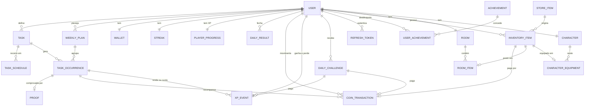

# GasmTask: documento de arquitetura

Desenho do MVP aprovado antes da implementação: requisitos, regras de negócio, modelo de dados, arquitetura, endpoints, fluxo do usuário e decisões técnicas. Descreve o sistema completo, inclusive o que ainda será construído; o status de cada fase está no [README](../README.md#fases).

Onde o enunciado original deixava brecha, principalmente em regras que afetam a sequência (streak) e o ranking, a decisão tomada está marcada com ⚑.

## 1. Requisitos funcionais

**Conta**
- RF01 — Cadastro com nome de exibição, e-mail, senha e fuso horário (detectado pelo navegador).
- RF02 — Login, renovação silenciosa da sessão e logout.
- RF03 — Editar perfil (nome, fuso, aparecer ou não no ranking) e preferências de lembrete (antecedência, horário de dormir e de acordar).

**Missões e planejamento**
- RF04 — Criar, editar e arquivar missões: nome, descrição, categoria, tipo (obrigatória ou extra), duração estimada, exigência de prova e pontos dentro da faixa do tipo.
- RF05 — Definir a recorrência de duas formas: dias da semana + horário, ou "N vezes por semana" com sugestão automática de dias, que pode ser editada.
- RF06 — Ver o plano da semana atual e da próxima, agrupado por dia.
- RF07 — Ajustar os dias futuros do plano: mover, remover ou incluir ocorrências.
- RF08 — Criar missões extras para datas futuras.

**Execução**
- RF09 — Tela Hoje: tarefas por horário, próxima tarefa, progresso, pontos do dia, saldo e streak.
- RF10 — Concluir uma tarefa, opcionalmente com foto como prova.
- RF11 — Anexar a prova depois da conclusão, no mesmo dia.
- RF12 — Ver o detalhamento da recompensa de cada conclusão.

**Progressão e economia**
- RF13 — Acompanhar streak atual, maior streak e status do dia (cumprido, pendente ou descanso).
- RF14 — Ver conquistas bloqueadas (com progresso) e desbloqueadas.
- RF15 — Consultar saldo e extrato de moedas.

**Loja e coleção**
- RF16 — Listar itens da loja por categoria, indicando os já adquiridos.
- RF17 — Comprar itens com moedas.
- RF18 — Ver o inventário.
- RF19 — Colocar e retirar itens do quarto, e equipar e desequipar itens do personagem. No MVP isso aparece como listas, sem renderização.

**Análise e social**
- RF20 — Ranking semanal por pontos, tarefas concluídas, moedas ganhas ou streak, com a posição do próprio usuário.
- RF21 — Estatísticas: concluídas, perdidas, pontos, moedas ganhas e gastas, streaks, desempenho semanal e mensal, planejado × concluído.
- RF22 — Resumo semanal (parcial durante a semana, final depois dela) com atalho para planejar a próxima.

**Lembretes, jogo e instalação**
- RF23 — Lembretes de tarefas, de dormir e de acordar (o que entra no MVP está na seção 9).
- RF24 — Endpoint com o estado de jogo consolidado, para a futura camada visual.
- RF25 — Instalação como PWA.

**Modo jogo (depois do MVP)**
- RF26 — Elo ranqueado: XP que sobe com as tarefas e desce com as obrigatórias perdidas, elos com divisões e uma roupa exclusiva por elo.
- RF27 — Atributos de RPG: cada categoria de tarefa treina um atributo do personagem, com nível próprio.
- RF28 — Desafios diários: três metas sorteadas por dia, valendo XP e moedas.
- RF29 — Protetor de sequência: item comprado com moedas que salva um dia de falha.

## 2. Requisitos não funcionais

- RNF01 — Mobile-first: layout pensado para 360–430 px, alvos de toque de pelo menos 44 px, barra de navegação inferior, contraste AA e rótulos acessíveis. Em telas grandes, o app vira uma coluna central.
- RNF02 — PWA instalável (manifest, service worker, ícones, modo standalone). O app abre offline, mas as ações exigem conexão. Não há sincronização offline no MVP.
- RNF03 — Segurança:
  - senha com BCrypt;
  - access token JWT de 15 minutos;
  - refresh token rotativo de 30 dias, em cookie HttpOnly/Secure/SameSite=Strict, guardado no banco como hash;
  - tudo autenticado, exceto auth e documentação;
  - segredos só por variável de ambiente.
- RNF04 — Validação em todas as entradas (Bean Validation) e nos uploads: o tipo é conferido pelo conteúdo do arquivo, só imagens, até 5 MB.
- RNF05 — Consistência: operações que movem moedas são transacionais e idempotentes. Restrições únicas no banco impedem recompensa duplicada por toque duplo ou retry, e o saldo nunca fica negativo.
- RNF06 — Correção temporal: "dia" e "semana" são sempre calculados no fuso do usuário, instantes são gravados em UTC e o relógio é injetável para testes determinísticos.
- RNF07 — Desempenho: a tela Hoje carrega com uma única requisição, e as consultas por (usuário, data) são indexadas.
- RNF08 — Manutenibilidade: módulos coesos, migrations versionadas, regras cobertas por testes unitários e endpoints principais cobertos por testes de integração contra PostgreSQL real.
- RNF09 — Portabilidade: `docker compose up` sobe banco, backend e frontend, com configuração por variáveis de ambiente.
- RNF10 — Observabilidade: logs estruturados e health check do Actuator, que o Compose usa.
- RNF11 — Privacidade (LGPD): coleta mínima de dados. O ranking mostra só o nome de exibição e é opcional. Provas são visíveis apenas para o dono.
- RNF12 — Evolutividade: domínio sem dependência de assets gráficos, API versionada em `/api/v1` e documentação OpenAPI gerada a partir do código.

## 3. Regras de negócio

**Tempo e calendário**
- RN01 — A semana vai de segunda a domingo. "Hoje", "amanhã" e "semana" são calculados no fuso do usuário.
- RN02 ⚑ — **Dia congelado** (revisada na Fase 2): o passado nunca muda. Hoje aceita inclusões de obrigatórias, inclusive de uma missão recém-criada (opção "Incluir hoje"), mas não aceita remover, mover para outro dia nem trocar o horário. Tirar uma obrigatória de hoje é o que permitiria apagar às 23h a academia não feita e salvar o streak; incluir só deixa o dia mais difícil. Extras continuam só a partir de amanhã (RN11).
- RN03 ⚑ — Exceção de onboarding: no dia do cadastro, o plano de hoje fica editável até a primeira conclusão. Assim o usuário já usa o app no primeiro dia, sem brecha para criar e concluir tarefas em série.
- RN04 — TimeOfDay, sempre no fuso do usuário:

  | Estado | Horário |
  |---|---|
  | MORNING | 05:00–11:59 |
  | AFTERNOON | 12:00–16:59 |
  | SUNSET | 17:00–18:59 |
  | NIGHT | 19:00–04:59 |

- RN05 — O estado do personagem é derivado, nunca gravado. Uma tarefa em andamento define a atividade: Estudo → STUDYING, Projeto → AT_COMPUTER, Leitura e Espiritualidade → READING, Sono → SLEEPING. Fora disso, o estado é IDLE. Em andamento é uma tarefa pendente de hoje cujo horário já começou e ainda não terminou; sem duração, vale uma janela de 30 minutos, e concluir a tarefa encerra a atividade.

**Missões e plano**
- RN06 ⚑ — Categorias fixas no MVP: Estudo, Leitura, Espiritualidade, Exercício, Sono, Projeto, Casa e Outros. Conquistas por categoria, ranking por categoria e o estado do personagem dependem de categorias conhecidas.
- RN07 — A recorrência é um conjunto de pares (dia da semana, horário opcional), no máximo um por dia por missão. Se o usuário escolher "N vezes por semana" sem indicar dias, o sistema sugere dias espaçados, priorizando segunda a sexta:
  - 2× → ter e qui;
  - 3× → seg, qua e sex;
  - 5× → seg a sex;
  - 6× → seg a sáb.

  O usuário ajusta a sugestão antes de salvar.
- RN08 — Os planos da semana atual e da próxima sempre existem. Eles são gerados a partir das missões recorrentes no cadastro e a cada virada de semana, com geração sob demanda como garantia. Gerar de novo não duplica nada.
- RN09 — Editar recorrência, tipo ou pontos de uma missão, ou arquivá-la, afeta só as ocorrências a partir de amanhã. Nos planos já gerados, as ocorrências futuras dessa missão são refeitas.
- RN10 — Cada ocorrência guarda um snapshot de tipo, categoria, pontos, moedas base e exigência de prova no momento em que é planejada.
- RN11 — Extras só podem ser criadas para datas futuras, a partir de amanhã.
- RN12 ⚑ — Teto diário: até 10 obrigatórias e 5 extras por dia (configurável). Com ranking entre usuários, sem teto bastaria planejar 50 extras para amanhã e marcar todas.

**Conclusão**
- RN13 — Uma ocorrência só pode ser concluída pelo dono, uma única vez, no próprio dia (até 23:59 no fuso dele). No MVP, a conclusão não pode ser desfeita.
- RN14 — Se a missão exige prova, a conclusão só é aceita com imagem.
- RN15 ⚑ — "No horário" significa concluir entre (horário planejado − 30 min) e (horário planejado + duração estimada + 30 min). Sem horário planejado, não há bônus de pontualidade. O limite inferior impede que alguém marque tudo às 00:01 e leve o bônus. O bônus também exige que a tarefa tenha sido planejada antes do próprio dia; senão bastaria incluir uma tarefa "para agora" e concluí-la em seguida.
- RN16 — Na virada do dia, as ocorrências pendentes viram perdidas. Nada do passado é apagado. Só ocorrências futuras e pendentes podem ser removidas, porque isso é editar o plano, não o histórico.

**Recompensas**
- RN17 ⚑ — A recompensa é calculada só no backend, com estes valores padrão:

  | Evento | Pontos | Moedas |
  |---|---|---|
  | Obrigatória concluída | 5 | 3 |
  | Extra concluída | 1 ou 2 (o usuário escolhe) | 1 |
  | Bônus no horário | — | +1 |
  | Bônus com prova | — | +1 |

  Uma obrigatória concluída no horário e com prova rende 5 moedas, como no exemplo do enunciado. O usuário não digita valores livres, porque com ranking entre usuários a pontuação ficaria inflável.
- RN18 — Pontos medem desempenho (ranking e estatísticas) e nunca são gastos. Moedas são a economia: ganhas em conclusões e gastas na loja.
- RN19 — Cada tipo de recompensa é pago no máximo uma vez por ocorrência. Isso é garantido por restrição única no banco.
- RN20 — A prova pode ir junto com a conclusão ou depois, até o fim do mesmo dia. O bônus é pago uma vez.
- RN21 — Toda movimentação de moedas gera um lançamento no extrato, e o saldo nunca fica negativo.

**Streak**
- RN22 — Cada dia fecha em um de três estados:
  - **cumprido**: havia ao menos uma obrigatória e todas foram concluídas. Soma 1 ao streak.
  - **descanso**: não havia obrigatória planejada. Não soma nem quebra.
  - **falha**: alguma obrigatória foi perdida. O streak volta a zero.
- RN23 — O streak sobe no instante em que a última obrigatória do dia é concluída. A quebra é aplicada no fechamento do dia. O maior streak é atualizado sempre que superado. Por isso o banco guarda só os dias fechados e o dia de hoje é somado na leitura: se uma obrigatória for incluída em hoje depois de o dia estar cumprido, ele volta a ficar pendente sem desfazer nada no banco. O fechamento roda num job a cada 10 minutos e, como garantia, antes das telas que mostram o streak.
- RN24 — Extras nunca afetam o streak.

**Loja, inventário, quarto e personagem**
- RN25 — Uma compra exige item disponível, saldo suficiente e item ainda não possuído (no MVP cada item é único, como numa coleção). Débito, lançamento no extrato e entrada no inventário acontecem na mesma transação, e o preço pago fica registrado.
- RN26 — Só itens do inventário podem ser usados. Móveis e decoração vão para o quarto. Itens de personagem ocupam um slot (cabeça, roupa ou acessório), com um item por slot. Colocar no quarto um item que já está lá não duplica, e vestir num slot ocupado troca o item.

**Conquistas e ranking**
- RN27 — Conquistas são avaliadas após cada conclusão e no fechamento do dia e da semana. O desbloqueio é único e permanente. Critérios do MVP:
  - total de conclusões;
  - conclusões por categoria;
  - conclusões da mesma missão;
  - streak atingido;
  - semana completa (todas as obrigatórias da semana concluídas).

  Os critérios são uma enum no padrão strategy (`AchievementCriterion`): um critério novo é uma constante e uma linha no seed. A avaliação roda depois de cada conclusão (o resultado traz as conquistas desbloqueadas) e no fechamento dos dias, que é quando streak e semanas completas mudam. O catálogo da loja vai de 5 a 200 moedas, para a primeira compra caber no primeiro dia.
- RN28 ⚑ — "Ler 10 livros" não é mensurável: o sistema sabe que você leu, não que terminou um livro. Virou "50 sessões de leitura". "Livro concluído" pode virar um evento próprio depois. "Estudar Java 20 vezes" vira o critério genérico "concluir a mesma missão 20 vezes".
- RN29 — O ranking é semanal e global, ordenado por pontos (padrão), tarefas concluídas, moedas ganhas ou streak atual. Mostra só o nome de exibição e o valor. ⚑ A semana é a de quem consulta (segunda a domingo no fuso dela), e cada pessoa entra com o que concluiu nessas datas de calendário. Empates dividem a posição (1, 1, 3). Só aparece quem escolheu aparecer e pontuou; quem se escondeu ainda vê onde estaria. O critério já é modelado como (período, métrica, escopo), então rankings mensais, por categoria, entre amigos e por grupos entram depois como novos valores.

**Acesso**
- RN30 — Toda consulta é filtrada pelo usuário autenticado. Pedir um recurso de outro usuário retorna 404, sem revelar que ele existe.

**Modo jogo**
- RN31 ⚑ — **Elo ranqueado.** O XP sobe com os pontos de cada tarefa concluída e com +10 no dia cumprido, e desce 5 a cada obrigatória perdida na virada do dia. Nunca fica abaixo de zero. A escada tem 22 degraus: Ferro, Bronze, Prata, Ouro, Platina, Diamante e Mestre, cada um com divisões 1 a 3, e Lenda no topo, a partir de 7.000 XP. O elo é derivado do XP atual, então sobe e desce. Cada elo a partir do Bronze entrega uma roupa exclusiva, que não está à venda; ela vale pelo maior XP já alcançado, então cair de elo não tira a roupa. Por padrão, o ranking ordena pelo XP. Sem temporadas no MVP: o elo é permanente.
- RN32 — **Atributos.** Estudo treina Inteligência, Exercício treina Força, Leitura treina Sabedoria, Espiritualidade treina Espírito, Sono treina Vitalidade, Projeto treina Criatividade, e Casa e Outros treinam Disciplina. O XP de um atributo é a soma dos pontos das tarefas concluídas dessas categorias. Cada nível pede 25 XP a mais que o anterior. Treino só soma, porque quem sobe e desce é o elo.
- RN33 ⚑ — **Desafios diários.** No primeiro acesso do dia, sorteiam-se três entre os desafios que o plano do dia permite cumprir e que ainda não foram cumpridos. O sorteio é fixo por pessoa e por dia e fica gravado. O catálogo: Madrugador (2 tarefas antes do meio-dia, só sorteado antes das 10h), Pontual (2 no horário), Registro (1 com foto), Milha extra (1 extra), Variedade (3 categorias), Dia completo e Maratona (4 tarefas). O progresso vem das tarefas do dia. Cada desafio cumprido paga +10 XP e +3 moedas uma vez; o que não foi cumprido expira com o dia.
- RN34 ⚑ — **Protetor de sequência.** Custa 40 moedas, e dá para guardar até 2. Na virada do dia, uma falha com protetor guardado consome um e fecha como dia protegido (FROZEN): a sequência não zera nem sobe. O protetor salva a sequência, não o XP, então a obrigatória perdida ainda custa XP.

## 4. Entidades e relacionamentos

Dois termos precisam ficar claros. Uma **missão** é o que você quer fazer ("Estudar Java, 5× por semana, 08:00"). Uma **ocorrência** é uma instância datada dela ("Estudar Java, seg 28/09, 08:00"). É a ocorrência que é concluída, perdida e recompensada.

| Entidade | Responsabilidade | Relacionamentos |
|---|---|---|
| User | Identidade e perfil: e-mail, hash da senha, nome de exibição, fuso, visibilidade no ranking. As preferências de lembrete ficam embutidas (`@Embeddable`) | Raiz dos dados do usuário |
| RefreshToken | Sessão renovável: hash, expiração, revogação | N:1 User |
| Task | Missão: nome, descrição, categoria, tipo, pontos, duração estimada, exigência de prova, ativa ou arquivada | N:1 User |
| TaskSchedule | Recorrência: dia da semana + horário | N:1 Task, único por dia |
| WeeklyPlan | Uma semana do usuário: início, data de geração, data de fechamento | N:1 User, única por semana |
| TaskOccurrence | Ocorrência: data, horário, snapshot da recompensa, status (PENDING, COMPLETED, MISSED) e dados da conclusão (quando, se foi no horário, pontos e moedas obtidos) | N:1 Task, N:1 WeeklyPlan |
| Proof | Evidência: tipo (IMAGE no MVP), chave no armazenamento, content type, tamanho, data | 1:1 TaskOccurrence |
| Wallet | Saldo de moedas | 1:1 User |
| CoinTransaction | Extrato imutável: valor (+/−), motivo (TASK_REWARD, ON_TIME_BONUS, PROOF_BONUS, PURCHASE), referência | N:1 User; aponta para TaskOccurrence ou InventoryItem |
| Streak | Streak atual, maior streak, último dia cumprido | 1:1 User |
| DailyResult | Fechamento de um dia: obrigatórias planejadas e concluídas, extras, pontos, moedas, status (FULFILLED, FAILED, REST, FROZEN) e streak ao fim do dia | N:1 User, único por data |
| PlayerProgress | XP atual (define o elo) e maior XP já alcançado (define as roupas de elo ganhas) | 1:1 User |
| XpEvent | Extrato imutável de XP: valor (+/−), motivo (TASK_COMPLETED, DAY_FULFILLED, TASK_MISSED, CHALLENGE_COMPLETED, BACKFILL) e referência | N:1 User; aponta para TaskOccurrence, dia ou DailyChallenge |
| DailyChallenge | Desafio sorteado para um dia: código, meta, recompensa (XP e moedas) e quando foi cumprido | N:1 User, único por (dia, código) |
| Achievement | Catálogo: código, nome, critério, limiar, categoria opcional, `assetKey` opcional | Seed |
| UserAchievement | Desbloqueio e data | N:1 User, N:1 Achievement |
| StoreItem | Catálogo: código estável, nome, descrição, categoria (FURNITURE, DECORATION, CHARACTER), slot, preço, disponibilidade, `assetKey` opcional | Seed |
| InventoryItem | Posse: item, data, preço pago | N:1 User, N:1 StoreItem, único por par |
| Room | O ambiente do usuário (um quarto no MVP) | 1:1 User |
| RoomItem | Item do inventário colocado no quarto | N:1 Room, 1:1 InventoryItem |
| Character | O personagem, sem estado gravado (RN05) | 1:1 User |
| CharacterEquipment | Item vestido em um slot | N:1 Character, 1:1 InventoryItem, único por slot |

Há algumas diferenças em relação à lista de entidades do enunciado:
- **TaskCompletion** foi absorvida pela TaskOccurrence. A relação seria 1:1 e sempre lida junto.
- **Reward** não virou tabela. A regra fica na RewardPolicy (configurável) e cada recompensa paga é registrada como CoinTransaction.
- **Entidades novas**: TaskOccurrence (sem ela não existe "planejado × concluído" nem "perdida"), Wallet, Streak, DailyResult (histórico do streak e base das estatísticas diárias) e RefreshToken (logout real).
- **Modo jogo:** o Streak ganhou os protetores guardados; as roupas de elo são StoreItems fora da loja (`available = false`), entregues no inventário com preço pago zero; os atributos não têm tabela, porque saem das ocorrências concluídas.
- **Room e Character** nascem finos de propósito. São as raízes que a camada visual vai enriquecer com posição, camada e aparência base, por meio de migrations que só adicionam colunas.



O mesmo diagrama está no README, e as tabelas já criadas, com todas as colunas, estão em [domain-model.md](domain-model.md).

## 5. Arquitetura proposta

```
PWA (React) ──HTTPS──▶ Nginx ──/api──▶ Spring Boot (monólito modular) ──▶ PostgreSQL
                   (serve o app)                        └──▶ volume de provas
```

O backend é um monólito modular: um pacote por módulo de negócio e, dentro de cada um, as camadas controller, service, repository, domain, dto e mapper.
- **Controllers** só validam a entrada, identificam o usuário e delegam.
- **Services** orquestram casos de uso e transações.
- **Regras** ficam em objetos de domínio e em políticas puras, sem Spring: RewardPolicy, DayLockPolicy, StreakRules, ScheduleDistributor e TimeOfDay. Todas são testáveis com testes unitários rápidos.
- **Comunicação entre módulos** acontece pelos services públicos, nunca pelo repositório de outro módulo.

O caso de uso central, concluir tarefa, roda numa única transação:
1. fecha os dias pendentes do usuário;
2. valida a conclusão (dono, dia de hoje, status pendente, prova se exigida);
3. a RewardPolicy calcula a recompensa;
4. a ocorrência registra a conclusão;
5. o RewardService lança as moedas;
6. o StreakService verifica se o dia foi cumprido;
7. o AchievementService avalia as conquistas;
8. publica o TaskCompletedEvent;
9. responde com o detalhamento.

Eventos são usados só onde desacoplam de verdade. O cadastro publica um UserRegisteredEvent, e cada módulo inicializa o que é seu (carteira, streak, quarto, personagem). Assim, a autenticação não conhece o jogo. O TaskCompletedEvent fica como ponto de extensão para notificações e para a futura camada visual.

A fronteira com o jogo é `GET /me/game-state`, que entrega tudo o que a camada visual vai precisar consumir. O domínio não conhece sprites: itens e conquistas têm só uma `assetKey` opcional.

No frontend, as páginas são organizadas por funcionalidade, e os hooks de dados ficam separados dos componentes de apresentação. TaskCard, StoreItemCard e RoomPage recebem dados prontos e não buscam nada. Por isso, adicionar personagem, sprite ou renderização 2D depois será composição, não reescrita. O resultado de cada conclusão passa por um canal de feedback de recompensa: hoje ele vira um toast, amanhã uma animação.

A navegação inferior tem cinco abas:
- **Hoje**, com a aba Semana, onde se planeja;
- **Estatísticas**;
- **Loja**;
- **Ranking**;
- **Perfil**, com conquistas, quarto, personagem e ajustes.

## 6. Estrutura de pastas

```
gasmtask/
├── backend/
│   ├── src/main/java/com/gasmtask/
│   │   ├── GasmTaskApplication.java
│   │   ├── shared/
│   │   │   ├── config/        # Clock, OpenAPI, Jackson
│   │   │   ├── security/      # SecurityConfig, JWT, CurrentUser
│   │   │   ├── exception/     # GlobalExceptionHandler, BusinessException, ErrorCode
│   │   │   ├── storage/       # FileStorage (interface) + LocalFileStorage
│   │   │   └── time/          # UserCalendar: hoje/amanhã/semana no fuso do usuário
│   │   ├── auth/              # cadastro, login, refresh, logout
│   │   ├── user/              # perfil e preferências
│   │   ├── task/
│   │   │   ├── controller/    # TaskController
│   │   │   ├── service/       # TaskService
│   │   │   ├── repository/    # TaskRepository
│   │   │   ├── domain/        # Task, TaskSchedule, TaskCategory, TaskKind, ScheduleDistributor
│   │   │   ├── dto/           # CreateTaskRequest, TaskResponse…
│   │   │   └── mapper/        # TaskMapper
│   │   ├── planning/          # WeeklyPlan, TaskOccurrence, DayLockPolicy, WeeklyPlanningService
│   │   ├── completion/        # TaskCompletionService, Proof, CompletionResult
│   │   ├── economy/           # RewardPolicy, RewardService, Wallet, CoinTransaction
│   │   ├── streak/            # Streak, DailyResult, StreakService, DayClosingJob
│   │   ├── achievement/       # Achievement, AchievementService, critérios (strategy)
│   │   ├── store/             # StoreItem, InventoryItem, StoreService, InventoryService
│   │   ├── room/              # Room, RoomItem
│   │   ├── character/         # PlayerCharacter (não Character, por causa de java.lang.Character), CharacterEquipment, CharacterSlot, CharacterStateResolver, Attribute e AttributeService
│   │   ├── progression/       # XP e elo: PlayerProgress, XpEvent, RankLadder, ProgressionService
│   │   ├── challenge/         # desafios diários: ChallengeType, ChallengePicker, ChallengeService
│   │   ├── demo/              # DemoDataSeeder (perfil dev)
│   │   ├── ranking/           # RankingService, RankingRepository (SQL), métrica, período e escopo
│   │   ├── stats/             # estatísticas e resumo semanal (somente leitura): PeriodTotals, StatsGranularity
│   │   ├── notification/      # ReminderPlanner, ReminderService (o NotificationGateway entra com o Web Push)
│   │   └── gamestate/         # GameStateService: junta o que os outros módulos já calculam
│   ├── src/main/resources/
│   │   ├── application.yml
│   │   └── db/migration/      # V1__auth.sql, V2__tasks_planning.sql, … + seeds
│   ├── src/test/java/com/gasmtask/   # unitários por regra, integração por módulo
│   ├── Dockerfile
│   └── pom.xml
├── frontend/
│   ├── src/
│   │   ├── app/               # App, rotas, providers, layout com barra inferior
│   │   ├── api/               # cliente HTTP, tipos das DTOs, chamadas por recurso
│   │   ├── auth/              # sessão: token em memória + refresh silencioso
│   │   ├── features/
│   │   │   ├── today/         # TodayPage, TaskCard, DayProgress, StreakBadge
│   │   │   ├── planning/      # WeekPlanner, TaskForm, ExtraForm
│   │   │   ├── stats/         # StatsPage, PlannedVsDoneChart, WeeklySummary
│   │   │   ├── store/         # StorePage, StoreItemCard, InventoryList
│   │   │   ├── ranking/       # RankingPage
│   │   │   └── profile/       # ProfilePage, Achievements, RoomPage, CharacterPage, Settings
│   │   ├── game/              # tipos do GameState e canal de feedback de recompensa
│   │   ├── components/        # Button, Card, BottomNav, ProgressBar, Sheet, EmptyState
│   │   ├── styles/            # tokens.css (variáveis), global.css
│   │   └── sw.ts              # service worker
│   ├── public/icons/
│   ├── vite.config.ts
│   ├── nginx.conf
│   └── Dockerfile
├── docs/                      # architecture.md, domain-model.md (ER), api-examples.http
├── docker-compose.yml
├── .env.example
└── README.md
```

Os demais módulos do backend seguem a mesma estrutura interna de `task/`.

## 7. Endpoints

Todas as rotas ficam sob `/api/v1`, trocam JSON e exigem `Authorization: Bearer <token>`, exceto `/auth/*` e a documentação.

| Método | Rota | O que faz |
|---|---|---|
| POST | `/auth/register` | Cadastro; devolve o access token e define o cookie de refresh |
| POST | `/auth/login` | Login |
| POST | `/auth/refresh` | Novo access token; rotaciona o refresh |
| POST | `/auth/logout` | Revoga o refresh e limpa o cookie |
| GET · PATCH | `/me` | Ver perfil; editar nome, fuso e visibilidade no ranking |
| GET · PUT | `/me/reminder-settings` | Ver e editar preferências de lembrete |
| GET | `/me/game-state` | Estado consolidado para a futura camada visual |
| GET · POST | `/tasks` | Listar missões (ativas ou arquivadas); criar missão |
| GET · PUT | `/tasks/{id}` | Detalhar; editar (vale a partir de amanhã) |
| POST | `/tasks/{id}/archive` | Arquivar e remover ocorrências futuras |
| GET | `/tasks/schedule-suggestion?timesPerWeek=3` | Dias sugeridos para "N vezes por semana" (RN07) |
| GET | `/weeks/current` · `/weeks/next` | Atalhos para a semana atual e a próxima |
| GET | `/weeks/{weekStart}` | Plano da semana por dia, indicando o que é editável |
| POST | `/weeks/{weekStart}/occurrences` | Incluir ocorrência de uma missão num dia futuro |
| POST | `/extras` | Criar extra para uma data futura |
| PATCH · DELETE | `/occurrences/{id}` | Mover ou remover ocorrência futura pendente |
| GET | `/today` | Tela Hoje em uma chamada |
| POST | `/occurrences/{id}/complete` | Concluir (multipart, `proof` opcional); devolve a recompensa detalhada |
| POST | `/occurrences/{id}/proof` | Anexar prova depois, no mesmo dia |
| GET | `/occurrences/{id}/proof` | Imagem da prova (só o dono) |
| GET | `/streak` | Streak atual, maior streak, status de hoje e protetores guardados |
| POST | `/streak/freezes` | Compra um protetor de sequência |
| GET | `/me/rank` | Elo, maior elo, escada, roupas de cada elo e últimas mudanças de XP |
| GET | `/achievements` | Conquistas com progresso e data de desbloqueio |
| GET | `/wallet` | Saldo e totais ganhos e gastos |
| GET | `/wallet/transactions` | Extrato paginado |
| GET | `/store/items` | Catálogo (filtro por categoria), com indicação de "já tenho" |
| POST | `/store/items/{id}/purchase` | Comprar |
| GET | `/inventory` | Itens do usuário e onde estão em uso |
| GET | `/room` | Quarto e itens colocados |
| PUT · DELETE | `/room/items/{inventoryItemId}` | Colocar ou retirar item do quarto |
| GET | `/character` | Slots equipados e estado derivado |
| PUT · DELETE | `/character/slots/{slot}` | Equipar ou desequipar |
| GET | `/rankings?metric=XP` | Ranking paginado por elo (padrão) ou da semana (`POINTS`, `COMPLETED_TASKS`, `COINS_EARNED`, `STREAK`), com a posição do usuário |
| GET | `/stats/overview` | Totais e streaks |
| GET | `/stats/history?granularity=WEEK&periods=8` | Planejado × concluído por semana ou mês |
| GET | `/weeks/{weekStart}/summary` | Resumo semanal |
| GET | `/reminders/upcoming?hours=24` | Próximos lembretes calculados |

Dois contratos merecem exemplo. O primeiro é a conclusão da última obrigatória do dia (o livro das 21:00), que responde `POST /occurrences/{id}/complete → 200`:

```json
{
  "occurrenceId": "0b6f2c1e-…",
  "completedAt": "2026-09-28T21:40:05-03:00",
  "onTime": true,
  "reward": { "points": 5, "baseCoins": 3, "onTimeBonus": 1, "proofBonus": 1, "totalCoins": 5 },
  "walletBalance": 125,
  "day": { "status": "FULFILLED", "mandatoryDone": 4, "mandatoryPlanned": 4 },
  "streak": { "current": 7, "longest": 7, "increasedNow": true },
  "unlockedAchievements": [{ "code": "STREAK_7", "name": "Uma semana firme" }]
}
```

O segundo é o estado que a futura camada de jogo transforma em imagem, via `GET /me/game-state → 200`:

```json
{
  "timeOfDay": "NIGHT",
  "coins": 320,
  "streak": { "current": 12, "longest": 15, "todayStatus": "PENDING" },
  "totals": { "completedTasks": 154, "achievements": 6 },
  "inventory": [
    { "code": "plant_small", "assetKey": "decoration.plant_small.v1" },
    { "code": "bookshelf_wood", "assetKey": "furniture.bookshelf_wood.v1" },
    { "code": "headphones_basic", "assetKey": "character.headphones_basic.v1" }
  ],
  "room": {
    "items": [
      { "code": "plant_small", "assetKey": "decoration.plant_small.v1" },
      { "code": "bookshelf_wood", "assetKey": "furniture.bookshelf_wood.v1" }
    ]
  },
  "character": {
    "state": "STUDYING",
    "equipped": { "HEAD": { "code": "headphones_basic", "assetKey": "character.headphones_basic.v1" } }
  }
}
```

Cada item vem pelo código estável e pela `assetKey`: a camada visual resolve a chave em sprite, e o domínio continua sem saber o que é um sprite.

## 8. Fluxo principal do usuário

1. **Cadastro.** O usuário informa nome, e-mail e senha; o fuso vem do navegador. O backend cria carteira, streak, quarto e personagem.
2. **Montar as missões.** Por exemplo: "Estudar Java, obrigatória, 5× por semana às 08:00" (o sistema sugere seg a sex), "Bíblia, 7×, 09:00", "Academia, 4×, 10:00". O plano da semana é gerado e, por ser o dia do cadastro, hoje já entra nele.
3. **Abrir o app.** A tela Hoje mostra a próxima tarefa, a lista por horário, quantas obrigatórias faltam para manter o streak, os pontos do dia e o saldo. Lembretes avisam no horário.
4. **Concluir.** O usuário toca na tarefa e escolhe "Concluir" ou "Concluir com foto". Aparece o detalhamento (+3 base, +1 no horário, +1 prova). Na última obrigatória do dia, o streak sobe na hora e as conquistas desbloqueadas aparecem.
5. **À noite.** O usuário cadastra extras para amanhã e ajusta os próximos dias, se precisar.
6. **Loja.** O usuário gasta moedas, o item vai para o inventário e depois pode ser colocado no quarto ou equipado no personagem (por enquanto, como listas).
7. **Virada do dia.** As pendentes viram perdidas, o dia fecha como cumprido, falha ou descanso, e o streak se mantém ou zera.
8. **Fim de semana.** O resumo semanal mostra planejado × concluído, extras, pontos, moedas, conquistas e taxa de conclusão. Em seguida vem "Planejar próxima semana", o usuário ajusta os dias e a semana seguinte começa pronta.
9. **A qualquer momento.** Ranking e estatísticas.

Esse fluxo funcionando de ponta a ponta é o critério de pronto do MVP.

## 9. Decisões técnicas e justificativas

| Decisão | Escolha | Por quê |
|---|---|---|
| Versões | Java 25 (LTS) e Spring Boot 4.1.1 | O Boot 4 é a linha estável desde novembro de 2025 e a recomendada para projetos novos. Ele exige no mínimo Java 17 e tem suporte completo ao Java 25. O Java 21, mínimo do enunciado, também serve: é só uma propriedade no `pom.xml`. |
| Estilo | Monólito modular: um pacote por funcionalidade, camadas dentro de cada módulo | A camada de jogo e o social entram como módulos novos. Microsserviços agora seriam custo sem benefício. |
| Domínio | Entidades JPA com comportamento + políticas puras; sem arquitetura hexagonal completa | Evita manter dois modelos (domínio e persistência) num MVP. A fronteira que importa, domínio × camada visual, já é a API. |
| Planejado × feito | Ocorrências materializadas por data | Sem um registro do que foi planejado, editar uma missão reescreveria o passado. Streak, "perdidas" e lembretes dependem desse registro. |
| Autenticação | Resource Server do Spring Security (JWT HS256 com Nimbus) + refresh token opaco e rotativo | Não há filtro JWT escrito à mão. Um access token curto e em memória limita o estrago de um XSS. O refresh guardado no banco permite logout de verdade, que JWT puro não tem. |
| Topologia | Mesma origem: o Nginx serve o PWA e faz proxy de `/api` (o proxy do Vite faz isso em dev) | Elimina CORS, e o cookie SameSite=Strict funciona naturalmente. |
| Economia | Extrato imutável + saldo com débito condicional atômico (`UPDATE … WHERE balance >= price`) | É auditável e à prova de corrida: duas compras simultâneas não deixam saldo negativo. |
| Tempo | Fuso por usuário; `timestamptz` para instantes, `date`/`time` locais para o plano; `Clock` injetável | Às 21h no Brasil já é o dia seguinte em UTC. E regra de horário só é testável com relógio controlado. |
| Fechamento do dia | Job agendado + fechamento sob demanda quando o usuário interage, ambos idempotentes | Streak certo às 00:05, mesmo que o job ainda não tenha rodado. |
| Banco | PostgreSQL + Flyway em SQL, `ddl-auto=validate`, UUID como id, catálogo da loja e conquistas como seed em migration | Schema versionado e revisável; o Hibernate só confere. UUID não expõe volume nem facilita enumerar recursos. |
| Código | DTOs como records e mapeamento manual; Lombok só com `@Getter` e construtor protegido nas entidades; código em inglês, UI e docs em português | `@Data` em entidade JPA quebra equals/hashCode e convida a setters. Mudança de estado passa por métodos de negócio, como `occurrence.complete(...)`. |
| Erros e docs | Problem Details (RFC 9457) com `code` de negócio; springdoc-openapi + arquivo `.http` com exemplos | Formato padrão. O frontend traduz o `code` em mensagem amigável, e documentação gerada do código não fica desatualizada. |
| Testes | JUnit Jupiter, AssertJ e Mockito nas regras; Spring Boot Test + MockMvc + PostgreSQL embutido (zonky `embedded-postgres`) nos endpoints | O H2 esconde diferenças do Postgres (tipos, constraints, funções de data). Testar contra o banco real evita falso verde. O PostgreSQL embutido roda os binários oficiais como processo local, então os testes não dependem de Docker. |
| Provas | Interface `FileStorage` com implementação em disco (volume Docker); validação pelo conteúdo; acesso só do dono | Permite trocar por S3/MinIO sem tocar no domínio. Se as provas virarem sociais um dia, é preciso remover o EXIF antes, porque foto de celular carrega GPS. |
| Assets futuros | `assetKey` lógico e opcional (ex.: `furniture.bookshelf.v1`) em itens e conquistas, no lugar de assetUrl/spriteId | A camada visual resolve chave → sprite. URL e engine gráfica são detalhes que mudam. |
| Frontend | React Router, TanStack Query, CSS Modules com variáveis CSS; sem kit de UI e sem biblioteca de gráficos | O TanStack Query cuida de cache e invalidação (concluir uma tarefa atualiza Hoje, carteira e streak). Variáveis CSS deixam o futuro tema dia/noite barato. Os gráficos do MVP são barras simples. |
| PWA | vite-plugin-pwa com `injectManifest`; cache só dos arquivos do app, API sempre pela rede | O service worker próprio já fica pronto para push, e cachear resposta autenticada arrisca mostrar dado velho. Instalar no celular exige HTTPS, então o README terá o passo a passo com túnel (cloudflared ou ngrok). |
| Notificações | No MVP: preferências, cálculo dos lembretes (`ReminderPlanner`, exposto em `/reminders/upcoming`) e lembrete local enquanto o app está aberto (aviso na tela ou notificação do sistema em segundo plano). Web Push (VAPID) fica para a fase seguinte, junto com a interface de envio (`NotificationGateway`) e o job que a usa: sem o push, ela não teria quem a chamasse | Push exige chaves VAPID, criptografia do payload e inscrições salvas, e no iPhone só funciona com o app instalado (iOS 16.4+). É a complexidade que o enunciado autoriza adiar. |
| XP e elo | Extrato de XP (como o de moedas) + linha de progresso travada a cada mudança; o elo é derivado do XP, as roupas do maior XP | Auditável e idempotente: restrições únicas impedem render ou cobrar XP duas vezes pela mesma tarefa, dia ou desafio. Derivar o elo permite trocar a escada sem migrar dados. |
| Desafios | Sorteio determinístico (semente por pessoa e dia) entre os elegíveis, gravado no primeiro acesso; progresso sempre recalculado | Gravar evita que o sorteio mude quando o plano muda durante o dia; recalcular o progresso evita guardar um contador que poderia divergir das tarefas. |
| Publicação | Dockerfile na raiz com uma imagem única: o Spring Boot serve o PWA (cache longo em `/assets`, revalidação no resto, `index.html` para as rotas do app) | Qualquer serviço de contêiner (Railway, Render, Fly.io) roda um processo só, no mesmo endereço, sem Nginx; o Compose continua com Nginx para rodar local. |
| Infra | Sem Redis, Kafka ou filas; jobs com `@Scheduled` | Um processo e um banco dão conta. Como os jobs são idempotentes, escalar horizontalmente depois só exige um lock distribuído (ex.: ShedLock). |

## Plano de implementação

O MVP é construído em cinco fases. Cada uma termina executável e testada:

1. **Fundação** (concluída). Monorepo, Docker Compose com PostgreSQL, esqueleto do Spring Boot, migrations, autenticação completa (cadastro, login, refresh rotativo, logout), perfil, tratamento global de erros e Swagger. No frontend: Vite + PWA, rotas, login, cadastro, barra inferior, tela Hoje inicial e perfil.
2. **Loop principal** (concluída). Missões, plano semanal, dia congelado, tela Hoje, conclusão com recompensas e provas, carteira, streak e fechamento do dia.
3. **Coleção** (concluída). Loja, inventário, quarto, personagem e conquistas.
4. **Visão** (concluída). Ranking, estatísticas, resumo semanal, estrutura de lembretes e game-state.
5. **Entrega** (concluída). Testes restantes, usuário de demonstração no perfil `dev`, imagem única para publicar e revisão final da documentação.

Depois do MVP veio o **modo jogo** (RF26 a RF29, RN31 a RN34): elo ranqueado, atributos, desafios diários e protetor de sequência.
