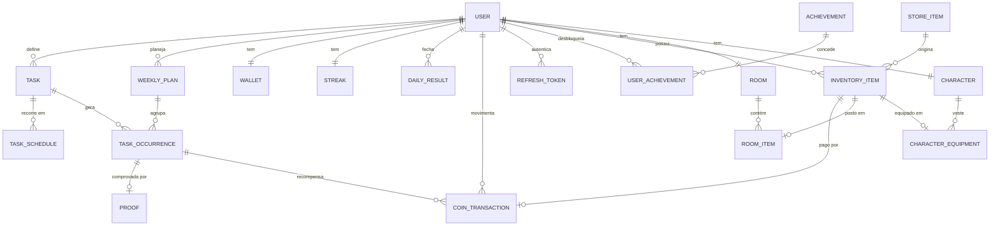
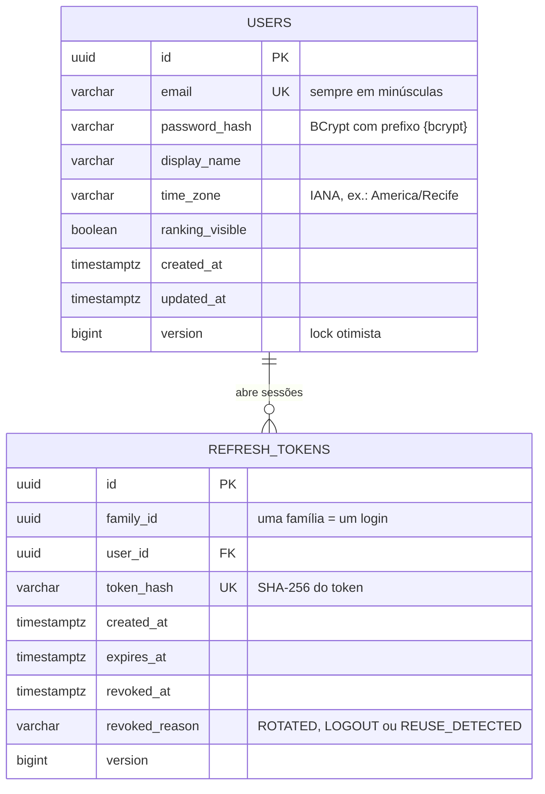

# Modelo de dados

Uma **missão** é o que a pessoa quer fazer ("Estudar Java, 5× por semana, 08:00"). Uma **ocorrência** é uma instância datada dela ("Estudar Java, seg 28/09, 08:00"). É a ocorrência que é concluída, perdida e recompensada. A descrição de cada entidade está na seção 4 de [architecture.md](architecture.md).

## Visão completa do MVP

## Tabelas já criadas

Criadas pela migration `V1__create_users_and_refresh_tokens.sql`, na Fase 1.

- **users.** O e-mail é único e gravado em minúsculas pela aplicação. A senha existe só como hash BCrypt com prefixo de algoritmo, o que permite trocar de algoritmo no futuro sem invalidar as senhas atuais. O fuso horário é parte do domínio: "hoje", "amanhã" e "semana" são sempre calculados nele.
- **refresh_tokens.** O token real só existe no cookie do navegador; o banco guarda o hash SHA-256. Cada login abre uma família, e cada renovação troca o token por outro da mesma família. Se um token já trocado reaparece, a família inteira é revogada. Uma check constraint garante que `revoked_at` e `revoked_reason` sejam preenchidos juntos. Os tokens somem em cascata com o usuário, e um job diário apaga os expirados há mais de uma semana.

## Convenções

- Ids são UUID gerados pela aplicação: não expõem volume nem facilitam enumerar recursos.
- Instantes usam `timestamptz`. O plano semanal (Fase 2) usará `date` e `time` locais, interpretados no fuso do usuário.
- O schema é versionado pelo Flyway em SQL; o Hibernate só valida o mapeamento (`ddl-auto: validate`).
- Entidades com `@Version` usam lock otimista: duas edições simultâneas não se sobrescrevem em silêncio (a API responde 409).
