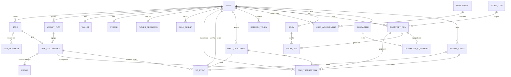
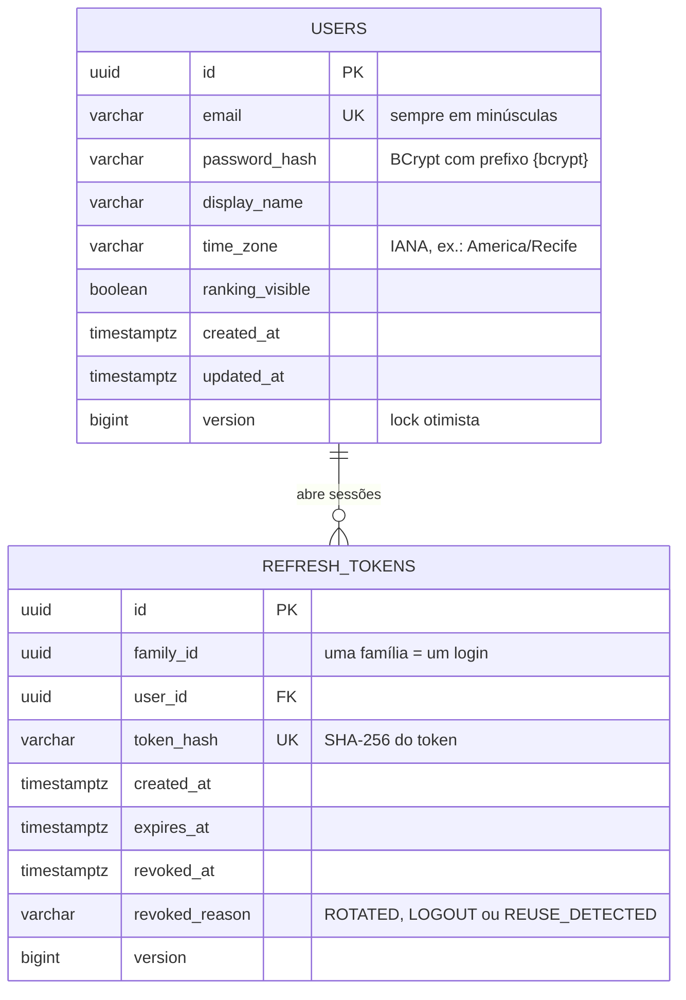

# Modelo de dados

Uma **missão** é o que a pessoa quer fazer ("Estudar Java, 5× por semana, 08:00"). Uma **ocorrência** é uma instância datada dela ("Estudar Java, seg 28/09, 08:00"). É a ocorrência que é concluída, perdida e recompensada. A descrição de cada entidade está na seção 4 de [architecture.md](architecture.md).

## Visão completa do MVP

## Tabelas já criadas

Criadas pela migration `V1__create_users_and_refresh_tokens.sql`, na Fase 1.

- **users.** O e-mail é único e gravado em minúsculas pela aplicação. A senha existe só como hash BCrypt com prefixo de algoritmo, o que permite trocar de algoritmo no futuro sem invalidar as senhas atuais. O fuso horário é parte do domínio: "hoje", "amanhã" e "semana" são sempre calculados nele.
- **refresh_tokens.** O token real só existe no cookie do navegador; o banco guarda o hash SHA-256. Cada login abre uma família, e cada renovação troca o token por outro da mesma família. Se um token já trocado reaparece, a família inteira é revogada. Uma check constraint garante que `revoked_at` e `revoked_reason` sejam preenchidos juntos. Os tokens somem em cascata com o usuário, e um job diário apaga os expirados há mais de uma semana.

## Convenções

- Ids são UUID gerados pela aplicação: não expõem volume nem facilitam enumerar recursos.
- Instantes usam `timestamptz`. O plano semanal (Fase 2) usará `date` e `time` locais, interpretados no fuso do usuário.
- O schema é versionado pelo Flyway em SQL; o Hibernate só valida o mapeamento (`ddl-auto: validate`).
- Entidades com `@Version` usam lock otimista: duas edições simultâneas não se sobrescrevem em silêncio (a API responde 409).

## Tabelas da Fase 2 (migrations V2 e V3)

Geradas a partir das migrations. Todos os horários são `TIMESTAMPTZ` em UTC; datas de calendário (`DATE`) e horários planejados (`TIME`) são do fuso do usuário. Contas criadas na Fase 1 ganham carteira e streak na própria migration V3.

### tasks

| Coluna | Tipo | Regras |
|---|---|---|
| id | UUID | PK |
| user_id | UUID | obrigatória, FK → users (on delete cascade) |
| name | VARCHAR(60) | obrigatória |
| description | VARCHAR(280) | opcional |
| category | VARCHAR(20) | obrigatória |
| kind | VARCHAR(10) | obrigatória |
| points | INTEGER | obrigatória |
| duration_minutes | INTEGER | opcional |
| requires_proof | BOOLEAN | obrigatória |
| archived_at | TIMESTAMPTZ | opcional |
| created_at | TIMESTAMPTZ | obrigatória |
| updated_at | TIMESTAMPTZ | obrigatória |
| version | BIGINT | obrigatória |

Restrições: `CHECK (kind IN ('MANDATORY', 'EXTRA'))`; `CHECK (category IN ('STUDY', 'READING', 'SPIRITUALITY', 'EXERCISE', 'SLEEP', 'PROJECT', 'HOME', 'OTHER'))`; `CHECK (points BETWEEN 1 AND 100)`; `CHECK (duration_minutes IS NULL OR duration_minutes BETWEEN 1 AND 720)`.

### task_schedules

| Coluna | Tipo | Regras |
|---|---|---|
| id | UUID | PK |
| task_id | UUID | obrigatória, FK → tasks (on delete cascade) |
| day_of_week | VARCHAR(9) | obrigatória |
| planned_time | TIME | opcional |

Restrições: `UNIQUE (task_id, day_of_week)`; `CHECK (day_of_week IN ('MONDAY', 'TUESDAY', 'WEDNESDAY', 'THURSDAY', 'FRIDAY', 'SATURDAY', 'SUNDAY'))`.

### weekly_plans

| Coluna | Tipo | Regras |
|---|---|---|
| id | UUID | PK |
| user_id | UUID | obrigatória, FK → users (on delete cascade) |
| week_start | DATE | obrigatória |
| generated_at | TIMESTAMPTZ | obrigatória |
| closed_at | TIMESTAMPTZ | opcional |

Restrições: `UNIQUE (user_id, week_start)`; `CHECK (EXTRACT(ISODOW FROM week_start) = 1)`.

### task_occurrences

| Coluna | Tipo | Regras |
|---|---|---|
| id | UUID | PK |
| user_id | UUID | obrigatória, FK → users (on delete cascade) |
| plan_id | UUID | obrigatória, FK → weekly_plans (on delete cascade) |
| task_id | UUID | FK → tasks (on delete set null) |
| occurrence_date | DATE | obrigatória |
| planned_time | TIME | opcional |
| title | VARCHAR(60) | obrigatória |
| category | VARCHAR(20) | obrigatória |
| kind | VARCHAR(10) | obrigatória |
| points | INTEGER | obrigatória |
| base_coins | INTEGER | obrigatória |
| duration_minutes | INTEGER | opcional |
| requires_proof | BOOLEAN | obrigatória |
| status | VARCHAR(10) | obrigatória |
| completed_at | TIMESTAMPTZ | opcional |
| on_time | BOOLEAN | opcional |
| earned_points | INTEGER | opcional |
| earned_coins | INTEGER | opcional |
| proof_attached | BOOLEAN | obrigatória |
| created_at | TIMESTAMPTZ | obrigatória |
| version | BIGINT | obrigatória |

Restrições: `CHECK (status IN ('PENDING', 'COMPLETED', 'MISSED'))`; `CHECK (kind IN ('MANDATORY', 'EXTRA'))`; `CHECK ((status = 'COMPLETED') = (completed_at IS NOT NULL))`.

### proofs

| Coluna | Tipo | Regras |
|---|---|---|
| id | UUID | PK |
| occurrence_id | UUID | obrigatória, única, FK → task_occurrences (on delete cascade) |
| user_id | UUID | obrigatória, FK → users (on delete cascade) |
| kind | VARCHAR(10) | obrigatória |
| storage_key | VARCHAR(200) | obrigatória |
| content_type | VARCHAR(50) | obrigatória |
| size_bytes | INTEGER | obrigatória |
| created_at | TIMESTAMPTZ | obrigatória |

Restrições: `CHECK (kind IN ('IMAGE'))`.

### wallets

| Coluna | Tipo | Regras |
|---|---|---|
| user_id | UUID | PK, FK → users (on delete cascade) |
| balance | INTEGER | obrigatória |
| total_earned | INTEGER | obrigatória |
| total_spent | INTEGER | obrigatória |
| updated_at | TIMESTAMPTZ | obrigatória |
| version | BIGINT | obrigatória |

Restrições: `CHECK (balance >= 0)`.

### coin_transactions

| Coluna | Tipo | Regras |
|---|---|---|
| id | UUID | PK |
| user_id | UUID | obrigatória, FK → users (on delete cascade) |
| amount | INTEGER | obrigatória |
| reason | VARCHAR(20) | obrigatória |
| occurrence_id | UUID | FK → task_occurrences (on delete set null) |
| created_at | TIMESTAMPTZ | obrigatória |

Restrições: `CHECK (amount <> 0)`; `CHECK (reason IN ('TASK_REWARD', 'ON_TIME_BONUS', 'PROOF_BONUS', 'PURCHASE'))`.

### streaks

| Coluna | Tipo | Regras |
|---|---|---|
| user_id | UUID | PK, FK → users (on delete cascade) |
| current_streak | INTEGER | obrigatória |
| longest_streak | INTEGER | obrigatória |
| last_fulfilled_date | DATE | opcional |
| last_closed_date | DATE | opcional |
| tracking_start_date | DATE | obrigatória |
| version | BIGINT | obrigatória |

### daily_results

| Coluna | Tipo | Regras |
|---|---|---|
| id | UUID | PK |
| user_id | UUID | obrigatória, FK → users (on delete cascade) |
| result_date | DATE | obrigatória |
| status | VARCHAR(10) | obrigatória |
| mandatory_planned | INTEGER | obrigatória |
| mandatory_done | INTEGER | obrigatória |
| extras_done | INTEGER | obrigatória |
| points | INTEGER | obrigatória |
| coins | INTEGER | obrigatória |
| streak_after | INTEGER | obrigatória |
| closed_at | TIMESTAMPTZ | obrigatória |

Restrições: `UNIQUE (user_id, result_date)`; `CHECK (status IN ('FULFILLED', 'FAILED', 'REST'))`.

### Índices

| Índice | Tabela | Colunas | Observação |
|---|---|---|---|
| ix_tasks_user | tasks | user_id | busca |
| uq_occurrences_task_date | task_occurrences | task_id, occurrence_date | único, parcial: task_id IS NOT NULL |
| ix_occurrences_user_date | task_occurrences | user_id, occurrence_date | busca |
| ix_occurrences_plan | task_occurrences | plan_id | busca |
| uq_coin_transactions_occurrence_reason | coin_transactions | occurrence_id, reason | único, parcial: occurrence_id IS NOT NULL |
| ix_coin_transactions_user_created | coin_transactions | user_id, created_at DESC | busca |

## Tabelas da Fase 3 (migration V4)

Catálogo da loja (18 itens, de 5 a 200 moedas) e de conquistas (15) entram como seed. A V4 também acrescenta `store_item_id` em `coin_transactions` (compras ficam no extrato com valor negativo) e cria quarto e personagem para as contas existentes.

### store_items

| Coluna | Tipo | Regras |
|---|---|---|
| id | UUID | PK |
| code | VARCHAR(40) | obrigatória, única |
| name | VARCHAR(60) | obrigatória |
| description | VARCHAR(200) | obrigatória |
| category | VARCHAR(12) | obrigatória |
| slot | VARCHAR(10) | opcional |
| price | INTEGER | obrigatória |
| available | BOOLEAN | obrigatória |
| asset_key | VARCHAR(60) | opcional |
| sort_order | INTEGER | obrigatória |

Restrições: `CHECK (category IN ('FURNITURE', 'DECORATION', 'CHARACTER'))`; `CHECK ((category = 'CHARACTER') = (slot IS NOT NULL))`; `CHECK (slot IS NULL OR slot IN ('HEAD', 'OUTFIT', 'ACCESSORY'))`; `CHECK (price > 0)`.

### inventory_items

| Coluna | Tipo | Regras |
|---|---|---|
| id | UUID | PK |
| user_id | UUID | obrigatória, FK → users (on delete cascade) |
| store_item_id | UUID | obrigatória, FK → store_items |
| price_paid | INTEGER | obrigatória |
| acquired_at | TIMESTAMPTZ | obrigatória |

Restrições: `UNIQUE (user_id, store_item_id)`.

### rooms

| Coluna | Tipo | Regras |
|---|---|---|
| id | UUID | PK |
| user_id | UUID | obrigatória, única, FK → users (on delete cascade) |
| created_at | TIMESTAMPTZ | obrigatória |

### room_items

| Coluna | Tipo | Regras |
|---|---|---|
| id | UUID | PK |
| room_id | UUID | obrigatória, FK → rooms (on delete cascade) |
| inventory_item_id | UUID | obrigatória, única, FK → inventory_items (on delete cascade) |
| placed_at | TIMESTAMPTZ | obrigatória |

### characters

| Coluna | Tipo | Regras |
|---|---|---|
| id | UUID | PK |
| user_id | UUID | obrigatória, única, FK → users (on delete cascade) |
| created_at | TIMESTAMPTZ | obrigatória |

### character_equipment

| Coluna | Tipo | Regras |
|---|---|---|
| id | UUID | PK |
| character_id | UUID | obrigatória, FK → characters (on delete cascade) |
| slot | VARCHAR(10) | obrigatória |
| inventory_item_id | UUID | obrigatória, única, FK → inventory_items (on delete cascade) |
| equipped_at | TIMESTAMPTZ | obrigatória |

Restrições: `UNIQUE (character_id, slot)`; `CHECK (slot IN ('HEAD', 'OUTFIT', 'ACCESSORY'))`.

### achievements

| Coluna | Tipo | Regras |
|---|---|---|
| id | UUID | PK |
| code | VARCHAR(40) | obrigatória, única |
| name | VARCHAR(60) | obrigatória |
| description | VARCHAR(200) | obrigatória |
| criterion | VARCHAR(30) | obrigatória |
| threshold | INTEGER | obrigatória |
| category | VARCHAR(20) | opcional |
| asset_key | VARCHAR(60) | opcional |
| sort_order | INTEGER | obrigatória |

Restrições: `CHECK (criterion IN ('TOTAL_COMPLETIONS', 'CATEGORY_COMPLETIONS', 'SAME_TASK_COMPLETIONS', 'STREAK_REACHED', 'WEEK_COMPLETE'))`; `CHECK ((criterion = 'CATEGORY_COMPLETIONS') = (category IS NOT NULL))`; `CHECK (threshold > 0)`.

### user_achievements

| Coluna | Tipo | Regras |
|---|---|---|
| id | UUID | PK |
| user_id | UUID | obrigatória, FK → users (on delete cascade) |
| achievement_id | UUID | obrigatória, FK → achievements |
| unlocked_at | TIMESTAMPTZ | obrigatória |

Restrições: `UNIQUE (user_id, achievement_id)`.

## Fase 4 (migrations V5 e V6)

Estatísticas, resumo semanal e game-state só leem tabelas que já existiam. Duas mudanças pequenas:

- **V5:** índice parcial `ix_occurrences_completed_date` em `task_occurrences (occurrence_date, user_id) WHERE status = 'COMPLETED'`, para o ranking semanal, que soma as concluídas de todos os usuários num intervalo de datas.
- **V6:** preferências de lembrete embutidas em `users` (`@Embeddable ReminderSettings`):

| Coluna | Tipo | Regras |
|---|---|---|
| reminder_tasks_enabled | BOOLEAN | obrigatória, padrão `true` |
| reminder_lead_minutes | INTEGER | obrigatória, padrão 10 |
| bedtime | TIME | opcional; nula desliga o lembrete de dormir |
| wake_time | TIME | opcional; nula desliga o lembrete de acordar |

Restrições: `CHECK (reminder_lead_minutes BETWEEN 0 AND 120)`. Os horários são do fuso do usuário.

## Modo jogo (migrations V7, V8 e V9)

### player_progress (V7)

| Coluna | Tipo | Regras |
|---|---|---|
| user_id | UUID | PK, FK → users (on delete cascade) |
| xp | INTEGER | obrigatória; define o elo |
| peak_xp | INTEGER | obrigatória; maior XP já alcançado, define as roupas de elo ganhas |
| updated_at | TIMESTAMPTZ | obrigatória |
| version | BIGINT | obrigatória |

Restrições: `CHECK (xp >= 0 AND peak_xp >= xp)`. A V7 calcula o XP inicial de quem já usava o app a partir do histórico (pontos das concluídas + 10 por dia cumprido − 5 por obrigatória perdida) e lança esse saldo como BACKFILL.

### xp_events (V7, V8)

| Coluna | Tipo | Regras |
|---|---|---|
| id | UUID | PK |
| user_id | UUID | obrigatória, FK → users (on delete cascade) |
| amount | INTEGER | obrigatória, diferente de zero |
| reason | VARCHAR(20) | obrigatória |
| occurrence_id | UUID | FK → task_occurrences (on delete set null) |
| event_date | DATE | só no bônus de dia cumprido |
| challenge_id | UUID | FK → daily_challenges (on delete set null) |
| created_at | TIMESTAMPTZ | obrigatória |

Restrições: `CHECK (reason IN ('TASK_COMPLETED', 'DAY_FULFILLED', 'TASK_MISSED', 'BACKFILL', 'CHALLENGE_COMPLETED'))`; `CHECK ((reason = 'DAY_FULFILLED') = (event_date IS NOT NULL))`. Índices únicos parciais: (occurrence_id, reason), (user_id, event_date, reason) e (challenge_id), para cada tarefa, dia ou desafio render XP uma vez só.

### Roupas de elo (V7)

Sete itens novos em `store_items`, um por elo do Bronze à Lenda, com `available = false` (fora da loja) e preço zero. A restrição de preço passou a ser `CHECK (price > 0 OR NOT available)`. Quando entregues, entram em `inventory_items` com `price_paid = 0`.

### daily_challenges (V8)

| Coluna | Tipo | Regras |
|---|---|---|
| id | UUID | PK |
| user_id | UUID | obrigatória, FK → users (on delete cascade) |
| challenge_date | DATE | obrigatória |
| code | VARCHAR(20) | obrigatória |
| target | INTEGER | obrigatória |
| xp_reward | INTEGER | obrigatória |
| coin_reward | INTEGER | obrigatória |
| completed_at | TIMESTAMPTZ | opcional |
| created_at | TIMESTAMPTZ | obrigatória |

Restrições: `UNIQUE (user_id, challenge_date, code)`; `CHECK (code IN ('EARLY_BIRD', 'ON_TIME', 'PHOTO', 'EXTRA_MILE', 'VARIETY', 'FULL_DAY', 'MARATHON'))`; `CHECK (target > 0 AND xp_reward >= 0 AND coin_reward >= 0)`. A V8 também acrescenta `challenge_id` em `coin_transactions` (motivo CHALLENGE_REWARD, único por desafio).

### Protetor de sequência (V9)

- `streaks` ganha `freezes` (INTEGER, obrigatória, `CHECK (freezes >= 0)`) e `last_frozen_date` (DATE, opcional).
- `daily_results.status` aceita FROZEN: falha salva por um protetor.
- `coin_transactions.reason` aceita STREAK_FREEZE, que, como PURCHASE, é sempre negativo: `CHECK ((reason IN ('PURCHASE', 'STREAK_FREEZE')) = (amount < 0))`.

## Títulos, baú semanal e planos (migration V10)

### Em `users`

| Coluna | Tipo | Regras |
|---|---|---|
| active_title | VARCHAR(30) | opcional; código do título exibido (ex.: `STUDY_MASTER`). Só aceita um título já ganho |
| plan | VARCHAR(10) | obrigatória, padrão `FREE`; `CHECK (plan IN ('FREE', 'PRO'))` |

Os títulos em si não têm tabela: são um enum (`Title`), três por atributo, nos níveis 3, 6 e 10, e saem do nível atual de cada atributo. Como atributo só sobe, título ganho não se perde. O nome exibido ("Mestre nos estudos") fica no app, a partir do código.

### weekly_chests

| Coluna | Tipo | Regras |
|---|---|---|
| id | UUID | PK |
| user_id | UUID | obrigatória, FK → users (on delete cascade) |
| week_start | DATE | obrigatória; a segunda-feira da semana premiada |
| fulfilled_days | INTEGER | obrigatória; dias cumpridos naquela semana (0 a 7) |
| tier | VARCHAR(10) | obrigatória; NONE, WOOD, SILVER, GOLD ou LEGENDARY |
| coins | INTEGER | obrigatória |
| xp | INTEGER | obrigatória |
| item_code | VARCHAR(40) | opcional; item da loja sorteado (só no ouro e no lendário) |
| created_at | TIMESTAMPTZ | obrigatória |
| opened_at | TIMESTAMPTZ | opcional; nula enquanto o baú está fechado |

Restrições: `UNIQUE (user_id, week_start)`; `CHECK (EXTRACT(ISODOW FROM week_start) = 1)`; `CHECK (fulfilled_days BETWEEN 0 AND 7 AND coins >= 0 AND xp >= 0)`. Abrir trava a linha (`SELECT … FOR UPDATE`): duas abas abrindo juntas pagam uma vez só.

### Extratos

- `xp_events` ganha `chest_id` (FK → weekly_chests, on delete set null) e o motivo CHEST_OPENED, com índice único parcial em `chest_id`.
- `coin_transactions` ganha `chest_id` e o motivo CHEST_REWARD, também com índice único parcial: cada baú paga uma vez.
